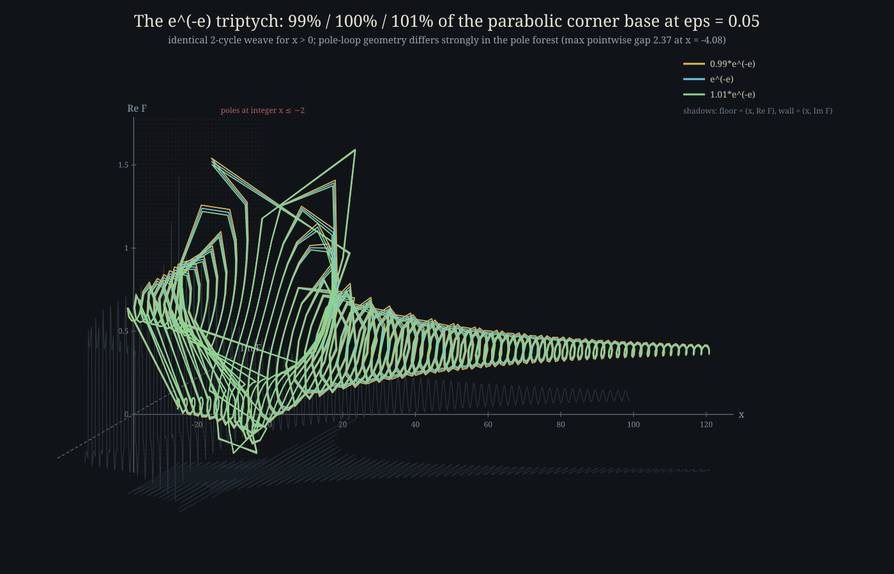

# `tet` — arbitrary-precision complex tetration

## 0. To the Tetration Forum — first, the credits

**This work exists because of, and for, the
[Tetration Forum](https://tetrationforum.org) community.** Nearly two
decades of open mathematics on that forum — constructions, proofs,
counterexamples, working code, and honest negative results — are the
foundation this implementation stands on. Before anything else, credit
where it belongs:

* **[bo198214 (Henryk Trappmann)](https://tetrationforum.org/member.php?action=profile&uid=1)** —
  founder of the forum, and co-author of the uniqueness theory for
  holomorphic Abel functions at complex fixed-point pairs that makes
  "*the*" canonical tetration a well-posed target at all.
* **Dmitrii Kouznetsov** — the Cauchy-integral construction
  (Math. Comp. 2009) that is the computational heart of this
  repository, developed and stress-tested in the open on the forum.
* **[sheldonison (Sheldon Levenstein)](https://tetrationforum.org/member.php?action=profile&uid=42)** —
  [fast accurate Kneser sexp algorithm](https://tetrationforum.org/showthread.php?tid=486),
  the [fatou.gp / merged-fixed-point program](https://tetrationforum.org/showthread.php?tid=1017),
  and the [complex-base tetration program](https://tetrationforum.org/showthread.php?tid=729)
  — for years the practical gold standard this project measures
  itself against.
* **[mike3](https://tetrationforum.org/member.php?action=profile&uid=56)** —
  the [Cauchy Integral Experiment](https://tetrationforum.org/showthread.php?tid=359)
  and [tetration for ALL bases, real and complex](https://tetrationforum.org/showthread.php?tid=828)
  threads, which map exactly the "cover the whole base plane"
  ambition (including the cut segment) pursued here.
* **[andydude (Andrew Robbins)](https://tetrationforum.org/member.php?action=profile&uid=2)** —
  the natural slog / Abel-matrix approach and
  [Designing a Tetration Library](https://tetrationforum.org/showthread.php?tid=146).
* **[Gottfried Helms](https://tetrationforum.org/member.php?action=profile&uid=9)** —
  the matrix (Carleman) operator school, including
  [fixpoint comparisons](https://tetrationforum.org/showthread.php?tid=83)
  directly relevant to this repo's fixed-point-pair machinery.
* **[jaydfox (Jay D. Fox)](https://tetrationforum.org/member.php?action=profile&uid=7)** —
  [accelerated slog via Abel-matrix inversion](https://tetrationforum.org/showthread.php?tid=1203).
* **[JmsNxn (James Nixon)](https://tetrationforum.org/member.php?action=profile&uid=163)** —
  the β-method and infinite-composition theory, and much of the
  forum's modern analytic energy.
* **[tommy1729](https://tetrationforum.org/member.php?action=profile&uid=47)**,
  **Ember Edison**, **MphLee**, and the many members whose questions,
  conjectures, and counterexamples shaped what "getting it right"
  means for every regime handled below.
* **William Paulsen & Samuel Cowgill** — whose complex-base papers
  grew from and fed back into these community discussions.

This repository's companion thread on the forum is
[Arbitrary Tetration in rust](https://tetrationforum.org/showthread.php?tid=1826)
(Computation board) — discussion, bug reports, and mathematical
critique are most welcome there or via GitHub issues.

---

**Tetration** `F_b(h)` — the analytic extension of the tower
`b^(b^(b^…))` of height `h` — for **complex bases** and **complex
heights**, at any requested decimal precision, in Rust.

```console
$ tet 20 2 0 0.5 0        # ²(2^^0.5): base 2, height 1/2, 20 digits
1.4587818160364217112
0

$ tet 20 0 1 0.5 0        # base i: complex base, complex machinery
1.1667009135704745687
0.73456353698672133009
```

The solver portfolio covers the base plane with the method that is
mathematically natural in each regime — exact special cases, Schröder
regular iteration at the attracting fixed point, Kouznetsov's
Cauchy-integral construction, warm-started continuation, Richardson
extrapolation on the parabolic boundary, and a germ-tracked
ε-continuation walker for the branch-cut segment `0 < b < e^{−e}`.
Every returned value is validated internally (functional-equation
post-check, solver residual gates); anything the program cannot certify
is an **honest error**, never a plausible-looking wrong number.

* **Language / deps:** Rust, [`rug`](https://crates.io/crates/rug)
  (GMP/MPFR/MPC bindings) for arbitrary-precision complex arithmetic,
  [`rayon`](https://crates.io/crates/rayon) for parallel kernels.
* **Interface:** a single CLI binary `tet`, plus a string-in/string-out
  library API (`tetration::tetrate_str`).
* **Definition used:** `F_b(0) = 1`, `F_b(z+1) = b^{F_b(z)}`, canonical
  (Kneser-type) normalization — real-on-real where a real-analytic
  solution exists, Schwarz-reflection and boundary-limit conventions
  everywhere else (§ [Conventions](#12-conventions-and-normalization)).
* **Status:** all base regimes covered with certified accuracy except
  two documented frontiers (parabolic boundary ≈ 15–17 digits; cut
  segment `0 < b < e^{−e}` under active development in this repo —
  see [`FAILURE_CASES.md`](FAILURE_CASES.md) and
  [`updates.md`](updates.md) for the live research log).
* **License:** Apache-2.0.

---

## Table of contents

0. [To the Tetration Forum — first, the credits](#0-to-the-tetration-forum--first-the-credits)
1. [Mathematical background](#1-mathematical-background)
   1. [What tetration is](#11-what-tetration-is)
   2. [Conventions and normalization](#12-conventions-and-normalization)
   3. [The base-plane geography: Shell–Thron](#13-the-base-plane-geography-shellthron)
2. [Building from source](#2-building-from-source)
3. [Command-line usage](#3-command-line-usage)
4. [Library usage](#4-library-usage)
5. [Coverage map](#5-coverage-map)
   1. [✅ Verified](#51--verified)
   2. [⏳ Pending / in progress](#52--pending--in-progress)
   3. [❌ Known-bad / missing](#53--known-bad--missing-by-design-or-documented-ceiling)
   4. [Gallery: the cut segment in 3D](#54-gallery-fx--bx-near-the-cut-in-3d)
6. [The algorithms, in detail](#6-the-algorithms-in-detail)
   1. [Classification](#61-classification-fixed-points-and-)
   2. [Exact cases](#62-exact-cases)
   3. [Schröder regular tetration](#63-schröder-regular-tetration-shellthron-interior)
   4. [Kouznetsov Cauchy-integral method](#64-kouznetsov-cauchy-integral-method-outside-shellthron)
   5. [Continuation solver](#65-continuation-solver)
   6. [iε-perturbation Richardson fallback](#66-iε-perturbation-richardson-fallback-parabolic-band)
   7. [The cut-base ε-walker](#67-the-cut-base-ε-walker-0--b--e−e)
7. [Numerical honesty](#7-numerical-honesty)
8. [Known limitations](#8-known-limitations)
   1. [Feasibility verdicts for the open gaps](#81-how-hard-would-closing-each-gap-be-feasibility-verdicts)
9. [Repository layout](#9-repository-layout)
10. [Testing](#10-testing)
11. [References](#11-references)

---

## 1. Mathematical background

### 1.1 What tetration is

Tetration is the fourth hyperoperation: iterated exponentiation. For a
non-negative integer height `n`,

```
b^^0 = 1,   b^^(n+1) = b^(b^^n)
```

so `2^^3 = 2^(2^2) = 16`. The interesting problem — the one this
project addresses — is extending `h ↦ b^^h` to **arbitrary complex
heights** `h` and **arbitrary complex bases** `b`, holomorphically,
satisfying

```
F_b(0) = 1        (normalization)
F_b(z+1) = b^F_b(z)   (the Abel / functional equation, "FE")
```

The FE alone does not pin down a unique function: any solution can be
pre-composed with a 1-periodic map. Uniqueness comes from **asymptotic
conditions at `Im z → ±∞`**: the canonical ("Kneser") tetration
approaches the fixed points of `z ↦ b^z` in the upper/lower half-planes
and is real-analytic on `h ∈ (−2, ∞)` for real bases `b > 1` where such
a solution exists. This is the function computed by Kouznetsov (2009)
for `b = e` and generalized since; it is the standard object of study
on [tetrationforum.org](https://tetrationforum.org).

### 1.2 Conventions and normalization

Precise statements of what `tet` returns:

* **Normalization** `F_b(0) = 1`, hence `F_b(1) = b`, `F_b(−1) = 0`,
  `F_b(−2) = −∞` (pole/branch point for real `b > 1`).
* **Principal branches everywhere**: `ln` and `b^z = exp(z·ln b)` use
  the principal branch of `ln b` (`Im ln b ∈ (−π, π]`).
* **Real bases `b > e^{−e}`, real heights:** the real-analytic
  (Kneser-canonical) value. `F` is real on the real axis; the solver
  enforces and verifies this (`F(z̄) = F̄(z)` Schwarz symmetry).
* **`Im(b) < 0`:** by Schwarz reflection, `F_b(h) := conj(F_{b̄}(h̄))`.
  This makes the two half-planes consistent and leaves only `Im(b) ≥ 0`
  to solve directly.
* **The cut segment `0 < b < e^{−e}`:** no real-analytic tetration
  exists (the real fixed point is repelling with multiplier
  `λ < −1`; the real iteration has an attracting 2-cycle). The
  canonical value is defined as the **boundary limit from the upper
  half base-plane**, `F_b(h) := lim_{ε→0⁺} F_{b+iε}(h)` — complex for
  non-integer real heights, and consistent with the `Im(b) < 0`
  reflection convention. This is the branch the ε-walker (§ 6.7)
  computes.
* **Integer heights** are computed by exact iteration for any base
  (no analytic machinery involved), so `tet 50 2 0 3 0` returns
  exactly `16`.

### 1.3 The base-plane geography: Shell–Thron

For the map `f(z) = b^z`, a distinguished fixed point is

```
L = −W₀(−ln b) / ln b,     with multiplier   λ = f'(L) = L · ln b
```

where `W₀` is the principal Lambert W branch. The **Shell–Thron
region** is the set of bases with `|λ| ≤ 1` — a cardioid-like domain
in the base plane. Its boundary crosses the real axis at
`η = e^{1/e} ≈ 1.44467` (where `λ = 1`, the parabolic case famous from
`b^^∞` convergence) and at `e^{−e} ≈ 0.06599` (where `λ = −1`, the
period-doubling point). The geography drives everything:

| where `b` lives | dynamics at `L` | natural method |
|---|---|---|
| Shell–Thron interior (`\|λ\| < 1`) | attracting | Schröder linearization |
| Shell–Thron boundary (`\|λ\| = 1`) | parabolic / neutral | hard: Écalle-type; here iε + Richardson |
| outside, real `b > η` | repelling, conjugate FP pair | Kouznetsov Cauchy integral |
| outside, general complex `b` | repelling, `W₀`/`W₋₁` pair | Kouznetsov, bi-asymptotic variant |
| real cut `0 < b < e^{−e}` | repelling with `λ < −1` | ε-continuation walker (this repo's construction) |

---

## 2. Building from source

The project is plain Cargo, but `rug` compiles the GNU bignum stack
(GMP, MPFR, MPC) from source the first time, which needs a C toolchain.

### 2.1 Prerequisites

* **Rust** ≥ 1.70 (any recent stable): install via
  [rustup.rs](https://rustup.rs) —
  `curl --proto '=https' --tlsv1.2 -sSf https://sh.rustup.rs | sh`
* **C toolchain + m4** (for the `gmp-mpfr-sys` build):
  * Debian/Ubuntu: `sudo apt install build-essential m4 diffutils`
  * Fedora: `sudo dnf install gcc make m4 diffutils`
  * macOS: `xcode-select --install` (m4 ships with the CLT)
  * Windows: use **WSL** (the MSVC target is not supported by
    `gmp-mpfr-sys`; MinGW works but WSL is the documented path)

### 2.2 Build, test, install

```console
$ git clone https://github.com/lukaszgryglicki/claude-tetration
$ cd claude-tetration
$ cargo build --release          # first build compiles GMP/MPFR/MPC: ~2-5 min
$ ./target/release/tet 20 2 0 0.5 0
1.4587818160364217112
0
```

Run the test suite (release mode strongly recommended — the numeric
tests are heavy):

```console
$ cargo test --release           # full suite; ~10-25 min depending on machine
$ cargo test --release --lib     # just the fast unit tests
```

Optionally place the binary on your `PATH`:

```console
$ cargo install --path .         # installs `tet` into ~/.cargo/bin
```

No configuration files, no runtime dependencies beyond the shared
system libc: the bignum stack is statically linked into the binary.

### 2.3 First-run sanity checks

```console
$ tet 50 2 0 3 0        # integer tower: exactly 16
$ tet 20 2.718281828459045235 0 0.5 0    # e^^0.5 ≈ 1.6463542337...
$ tet 20 1.4142135623730950488 0 0.5 0    # √2, inside Shell-Thron
1.2436216276685218043
$ tet 20 0 1 0.5 0      # base i
1.1667009135704745687
0.73456353698672133009
```

---

## 3. Command-line usage

```
tet <precision_digits> <base_re> <base_im> <height_re> <height_im>
```

* `precision_digits` — requested decimal precision (positive integer).
  Internally mapped to MPC binary precision with guard bits.
* the four remaining arguments are decimal strings for
  `b = base_re + i·base_im` and `h = height_re + i·height_im`.

**Output:** two lines on stdout — `Re F_b(h)`, then `Im F_b(h)`.
**Exit codes:** `0` success; `1` honest failure (diagnostic on stderr);
`2` usage error.

Diagnostics go to stderr and can be tuned with environment variables:

| variable | effect |
|---|---|
| `SILENT=1` | suppress all stderr diagnostics; stdout only |
| `VERBOSE=1` | per-iteration trace (LM residuals, walker steps, grid setup) |
| `TET_KOUZ_ANDERSON=1` / `TET_KOUZ_PICARD=1` | force alternative Kouznetsov iterators (diagnostics) |
| `TET_KOUZ_NO_EM=1`, `TET_KOUZ_EM_K=<n>` | Euler–Maclaurin correction A/B switches |
| `TET_KOUZ_CUT_ANCHOR=<ε₀>`, `TET_KOUZ_CUT_RATIO=<r>` | cut-walker anchor height (default 2.0) and schedule ratio (default 0.72) |
| `TET_KOUZ_UNWRAP_DEBUG=1` | branch-unwrap winding diagnostics |
| `TET_KOUZ_RESID_DUMP=<file>` | dump residual profiles for offline analysis |
| `TET_MT=<n>` | **opt-in multithreading.** Unset/`0` (default): fully serial, the original code paths, untouched. `1`: parallel across all logical cores. `n ≥ 2`: parallel with exactly `n` threads. Outputs are **bit-identical** to serial mode (see below). |

**MT mode.** Big-number tetration is dominated by one hot loop: the FFT-based
Newton–Krylov matvecs inside the Kouznetsov solver (measured ≈ 90 % of a
20-digit cut-adjacent solve). With `TET_MT` set, the radix-2 FFT runs its
butterflies in parallel over disjoint index pairs, and the per-node
transcendental maps (`b^F`, branch logs, boundary corrections) run as parallel
element-wise maps. **No floating-point accumulation is ever reordered** —
GMRES inner products, norms and Euler–Maclaurin sums stay serial, and each
parallel output element is produced by the same correctly-rounded MPC
operations on the same operands in the same order as the serial code. MT-mode
results are therefore bit-identical to the default, verified by A/B `diff` on
Kouznetsov, Schröder and complex-base cases. Speedup is workload-dependent:
grids of `n = 4096–32768` nodes at modest precision parallelize well; tiny
grids and pure-Schröder evaluations gain little. Measured on a 16-core box
(`tet 30 2 0 0.5 0`, a 30-digit Kouznetsov solve, machine under background
load, values `diff`-identical): serial 732 s → `TET_MT=4` 362 s (2.0×) →
`TET_MT=16` 167 s (**4.4×**). The iε-Richardson ladder
(§ 6.4) additionally evaluates its rung solves concurrently even in default
mode (that parallelism is across independent solves, which does not affect
any individual solve's arithmetic).

Examples:

```console
$ tet 20 3000 0 0.5 0                    # large real base
7.6097169725553975773
0

$ tet 20 -2 0 0.5 0                      # negative real base — prints an
0.048401404215115702870                  # honesty warning: ~8 certified
0.31161889348200255046                   # digits for this hard base (§7)

$ SILENT=1 tet 20 1.4142135623730950488 0 0.5 0   # √2, quiet mode
1.2436216276685218043
0

$ VERBOSE=1 tet 20 0.04 0 0.5 0          # cut-segment base: ε-walker, slow!
```

---

## 4. Library usage

The crate exposes the same functionality as a library:

```rust
// Cargo.toml:  tetration = { git = "https://github.com/lukaszgryglicki/claude-tetration" }

fn main() -> Result<(), String> {
    // string-in / string-out, precision in decimal digits
    let (re, im) = tetration::tetrate_str("30", "2", "0", "0.5", "0")?;
    println!("2^^0.5 = {re} + {im} i");
    Ok(())
}
```

Lower-level entry points (`dispatch::tetrate`, per-method `setup_*` /
`eval_*` pairs that amortize per-base work across many heights) are
public as well; see the module docs in `src/`.

---

## 5. Coverage map

State of the (b, h) plane as implemented today, with certified
accuracy at the standard 20-digit request:

| base class | heights | method | accuracy / status |
|---|---|---|---|
| `b = 0`, `b = 1` | integer / all | exact special case | exact |
| any `b` | integer `h` | direct iteration | exact |
| Shell–Thron interior (e.g. `√2`, `0.5`, `i`-ish interior) | all complex | Schröder | full requested digits |
| real `b > η` (2, e, 10, 3000, 1e5, …) | all complex | Kouznetsov (Schwarz-symmetric) | full requested digits |
| general complex outside ST (`−2`, `i`, `−0.8+0.4i`, …) | all complex | Kouznetsov (bi-asymptotic) or Schröder-at-repelling | full digits for most; hard fringe bases certify fewer digits and **say so** (e.g. `b=−2` currently certifies ~8 digits with an explicit warning); bases whose strip geometry admits no rectangle-Cauchy solution (e.g. `−0.8+0.4i`) **ERR honestly** — see § 5.3 |
| `Im(b) < 0` | all complex | Schwarz reflection to `Im(b) > 0` | as the reflected class |
| Shell–Thron **boundary band** (`0.95 ≤ \|λ\| ≤ 1.05`, e.g. `b = η`, `1.4448`) | all complex | continuation → iε Richardson R₄ | **≈ 15–17 digits** (documented ceiling; warns). Complex bases **deep** in the band (`\|λ\| ≳ 0.99`) may honestly ERR — see § 5.3 |
| real cut segment `0 < b < e^{−e}` | all complex | ε-continuation walker | **research frontier in this repo** — construction complete, walks at record depth; see § 6.7 and `updates.md` |
| `b = 0` non-integer `h`, negative integer heights `h ≤ −2` | — | honest ERR (mathematically singular) | n/a |

### 5.1 ✅ Verified

Everything below is re-checked by the test battery and was re-verified
against the current build; witness values are exact to the shown
digits:

```
tet 20 2     0 0.5 0  → 1.4587818160364217112
tet 20 100000 0 0.5 0 → 12.387261344067895865
tet 20 3000  0 0.5 0  → 7.6097169725553975773
tet 20 0 1   0.5 0    → 1.1667009135704745687 + 0.73456353698672133009 i
tet 20 1.4142135623730950488 0 0.5 0 → 1.2436216276685218043
tet 20 2.718281828459045235 0 0.5 0  → 1.6463542337511945809
tet 50 2 0 3 0 → 16 (exact)
```

Covered classes: exact special cases; integer heights for any base;
Shell–Thron interior (Schröder, full digits); real bases `b > η` from
just past the boundary up to at least `10⁵` (Kouznetsov, full digits);
`Im(b) < 0` by Schwarz reflection; complex heights across all of the
above (spot-checked against mpmath and the FE post-check).

### 5.2 ⏳ Pending / in progress

* **Cut segment `0 < b < e^{−e}` at exactly `Im b = 0`** — the
  ε-walker (§ 6.7) is actively descending; four successive walls have
  been diagnosed and fixed this campaign (record frontier `ε ≈ 0.068`
  at `b = 0.06`, from `ε ≈ 0.92` at the start; the newest defense —
  reactive node-tier escalation on near-miss solves — is live in the
  current walk). The `ε = 0` endpoint is not yet certified. Live
  status: [`updates.md`](updates.md),
  [`FAILURE_CASES.md`](FAILURE_CASES.md) § J. Note complex bases
  arbitrarily close to the cut (`b + iε`, any fixed `ε > 0`) already
  work as ordinary complex bases.
* **Hard fringe complex bases** (e.g. `b = −2`, some bases with
  awkward fixed-point geometry): currently certify fewer digits than
  requested and print an explicit accuracy warning; improving their
  conditioning is ongoing.

### 5.3 ❌ Known-bad / missing (by design or documented ceiling)

* **Shell–Thron boundary band** (`0.95 ≤ |λ| ≤ 1.05`): hard ceiling of
  **≈ 15–17 digits** via iε-Richardson regardless of requested
  precision; full precision would require Abel/Écalle parabolic
  iteration (not implemented). The program warns rather than
  overclaims.
* **Complex bases deep in the parabolic band** (`|λ| ≳ 0.99`, e.g.
  `b = 0.0653 + 0.025i` with `|λ| = 0.995`): Schröder correctly
  refuses (parabolic), the Kouznetsov LM iteration stalls at an O(1)
  residual, and the iε-Richardson probes land back inside the band.
  Since the honesty gate (§ 7) rejects stalled solves, these bases
  **ERR cleanly** instead of returning plausible-looking garbage.
  (Before the gate, one such stalled solve produced values that
  diverged to `∞` under upward iteration while the true orbit is
  bounded — caught during the § 5.4 chart campaign and now a
  regression case.)
* **Outside-ST bases whose sampling strip contains a zero of `F`**
  (discovered on `b = −0.8 + 0.4i`, `|λ| ≈ 1.15`): the LM solve stalls
  at an O(1) residual that is partly a *phantom* (principal-log
  branch break on the left edge — the two-sided unwrap drops it
  1.577 → 9.5e-4) and partly *genuine* (the remaining 9.5e-4 floor is
  node-count-invariant and spatially broad: the rectangle Cauchy
  equation has no solution on this strip, likely because `|F|` dips
  to ≈ 0.44 near the sample line and `log_b F` crosses a branch cut).
  **There is no independently verified tetration value at such bases
  yet**: an earlier test-blessed 20-digit value turned out to be a
  discretization artifact — 20/22/25-digit runs each give a
  *completely different* `F(0.5)` while all passing the (recurrence-
  enforced, hence tautological) FE post-check. The honesty gate now
  rejects all of them and the CLI ERRs cleanly; the regression tests
  assert the refusal. (The refusal is *expensive* — principal solve +
  two-sided retry + the full iε-Richardson ladder, each probe itself
  retried — tens of minutes at 20+ digits; honesty over speed.)
  Full anatomy: `FAILURE_CASES.md` § A.2.
  Closing this class needs a non-rectangular (Paulsen-style) contour
  that avoids the in-strip zero of `F` — a research item (§ 8.1).
* **`b = 0` at non-integer heights** — no principal-branch value
  exists: honest ERR.
* **Negative integer heights `h ≤ −2`** — genuine singularities
  (`F(−2) = log_b 0 = −∞`): honest ERR.
* **Paulsen–Cowgill conformal-map machinery** — not implemented;
  pathological bases that would need it error out cleanly instead of
  guessing.

### 5.4 Gallery: `f(x) = b^^x` near the cut, in 3D

What does tetration *look like* for a base just below `e^{−e}`? Since
`f(x)` is complex even for real `x` there, the natural picture is a
**3D curve** `x ↦ (x, Re f, Im f)`. The charts below sweep real
heights `x ∈ [−30, 120]` (~1000 adaptive points per base, denser in
the interesting bands) for `b` at 99%, 100% and 101% of `e^{−e}`,
each evaluated at `b + 0.05i` — the uniform-`iε` preview of the cut
limit (the exact `Im b = 0` value is what the § 6.7 walker computes;
at `ε = 0.05` all three bases are ordinary, fully-verified complex
bases solved by Schröder).

| chart | file |
|---|---|
| `b = 0.99·e^{−e}` | [`docs/charts/tet3d_b099eme_eps005.svg`](docs/charts/tet3d_b099eme_eps005.svg) |
| `b = e^{−e}` exactly | [`docs/charts/tet3d_b100eme_eps005.svg`](docs/charts/tet3d_b100eme_eps005.svg) |
| `b = 1.01·e^{−e}` | [`docs/charts/tet3d_b101eme_eps005.svg`](docs/charts/tet3d_b101eme_eps005.svg) |
| all three overlaid | [`docs/charts/tet3d_triptych_eps005.svg`](docs/charts/tet3d_triptych_eps005.svg) |
| `ε`-convergence (`0.1` vs `0.05`) | [`docs/charts/tet3d_b099eme_eps_convergence.svg`](docs/charts/tet3d_b099eme_eps_convergence.svg) |



Findings, all reproducible from the CSVs in
[`docs/charts/data/`](docs/charts/data/) (3 × 1015 + 256 points,
**zero solver errors**):

* **Pole forest** (`x ≲ −2`): every integer `x ≤ −2` is a genuine
  pole (the recurrence hits `log_b 0`), and the CLI honestly ERRs
  exactly there; the sweep dodges integers by `+0.013` and the curve
  executes a widening loop around each pole (red markers in the
  charts). Largest excursion `|f| ≈ 1.80` at `x ≈ −1.99`.
* **2-cycle weave** (`x ≳ 2`): the fixed-point multiplier is
  `λ ≈ −0.98` (nearly parabolic, *negative*), so the orbit converges
  by slowly-damped **period-2 alternation** — a helix that tightens
  around `L ≈ 0.376 + 0.048i` and is still visibly braided at
  `x = 120`.
* **The three bases are nearly indistinguishable at `ε = 0.05`** on
  `x > 0` (pointwise gap `< 0.02` there); they differ materially only
  inside the pole loops (max gap 2.37 at `x = −4.08`). The famous
  qualitative divide at `b = e^{−e}` (convergence vs 2-cycle on the
  real line) emerges **only in the `ε → 0` limit** — which is
  precisely why the § 6.7 walker exists.
* **The `ε`-convergence overlay uses `0.1` vs `0.05`** (both
  Schröder-verified): halving ε moves the curve by up to 1.80 in the
  pole forest, 0.64 near the seam (`x = 2.2`) and 0.13 out at
  `x > 50` — a strong, *non-uniform* ε-dependence. The
  originally-planned `ε = 0.025` level sits deep in the parabolic
  band (`|λ| = 0.995`) where the solver now honestly ERRs (§ 5.3) —
  the first attempt at that sweep is what exposed the acceptance-gate
  bug described there.

Reproduce with [`scripts/chartgen.sh`](scripts/chartgen.sh) (sweep →
CSV, 14-way parallel) and [`scripts/plot3d.py`](scripts/plot3d.py)
(CSV → SVG, dependency-free cabinet projection with floor/wall
shadow projections; non-finite or `|f| > 50` points break the curve
rather than skew the scale).

---

## 6. The algorithms, in detail

This section is written for readers who want to check the mathematics
or port the ideas. Each subsection names the implementing module.

### 6.1 Classification: fixed points and λ (`src/regions.rs`, `src/lambertw.rs`)

For `b ∉ {0, 1}` compute `L = −W₀(−ln b)/ln b` and `λ = L·ln b` in
full working precision (Lambert W by Halley iteration with a
branch-aware seed, `src/lambertw.rs`). Classify by `|λ|` with a guard
band: interior `< 0.95`, boundary band `0.95…1.05`, outside `> 1.05`
(split into real-positive and general-complex arms). The band exists
because Schröder's geometric convergence rate is `|λ|` — uselessly slow
near 1 — and the Kouznetsov contour height blows up like
`1/|arg λ|` there.

### 6.2 Exact cases (`src/integer_height.rs`, `src/dispatch.rs`)

`b = 1 → 1`; `b = 0` alternates `1, 0, 1, …` on non-negative integers;
integer heights iterate `b^·` (or `log_b` for negative heights down to
`h = −1`) in exact big-float arithmetic. These paths bypass all
analytic machinery, so they are also used as ground truth in tests.

### 6.3 Schröder regular tetration (Shell–Thron interior) (`src/schroder.rs`)

At an attracting `L` (`|λ| < 1`), Schröder's equation
`σ(f(z)) = λ·σ(z)`, `σ(L) = 0`, `σ'(L) = 1` linearizes the dynamics.
With `σ̃(w) = σ(L + w)`:

```
F_b(z) = L + σ̃⁻¹( σ̃(1 − L) · λ^z )
```

satisfies the FE analytically and `F_b(0) = 1` exactly. The
implementation computes σ̃ Taylor coefficients from the recursion

```
c_N (λ^N − λ) = − Σ_{n=1}^{N−1} c_n λ^n [w^{N−n}] q(w)^n,
h(w) = (b^{L+w} − L)/λ = w·q(w),  q_j = (ln b)^j/(j+1)!
```

then reverts the series for σ̃⁻¹ and evaluates by Horner. Two shift
mechanisms extend the reach when Taylor disks are too small:
a **σ̃-shift** (iterate the dynamics toward `L` until inside the disk,
compensating by powers of λ) and an **h-shift** (evaluate at `z + k`,
then apply `b^·` or `log_b` exactly `k` times). The same machinery,
run at a **repelling** fixed point with backwards iteration, handles a
fringe of bases just outside the boundary — with a canonicality guard
(§ 7) because the repelling-branch solution need not be the canonical
one.

### 6.4 Kouznetsov Cauchy-integral method (outside Shell–Thron) (`src/kouznetsov.rs`)

The workhorse for `|λ| > 1.05`. The canonical `F` is pinned by its
behaviour on a vertical line: sample `F` at `N` uniform nodes on
`Re z = 1/2`, `t ∈ [−T, T]`, and refine by Cauchy's integral over the
rectangle `Re ∈ [−1/2, 3/2]`, `Im ∈ [−T, T]` whose four edges are
known in terms of the samples themselves:

* right edge: `F(3/2 + it) = b^{F(1/2+it)}` (the FE forward),
* left edge: `F(−1/2 + it) = log_b F(1/2+it)` (the FE backward, with a
  **continuously unwrapped** log branch along the curve),
* top/bottom edges: `F ≡ L_upper` / `L_lower` (the asymptotics).

For real `b > η` the pair is `(L, L̄)` (Schwarz-symmetric, each iterate
re-symmetrized); for complex bases the pair comes from the `W₀` and
`W₋₁` Lambert branches, in opposite half-planes, with an automatic
partner search. Discretization: trapezoid with tail truncation set by
the decay rate `|arg λ|` (`T ≈ (digits+8)·ln10 / |arg λ|`), node count
scaled to keep the analyticity-strip resolution, plus an
**Euler–Maclaurin boundary correction** for the O(h²) edge error. The
integral-equation Jacobian is applied via **FFT cross-correlation**
(`src/fft.rs`, O(N log N) matvecs), and the nonlinear system is solved
by **Levenberg–Marquardt Newton–Kantorovich** with multi-start
retries (Anderson-accelerated Picard available as a diagnostic
fallback). Converged samples are then normalized: a Newton search
finds the shift δ with `F(δ) = 1`, and heights are evaluated by one
final Cauchy application plus exact integer FE steps.

Accuracy is certified two ways: the solver's boundary residual (an
a-posteriori bound on how well the sampled `F` satisfies the FE on the
contour) and an independent functional-equation spot check at the
requested height (§ 7).

### 6.5 Continuation solver

Near-parabolic bases sit outside every cold-start Newton basin. The
continuation solver walks from a comfortably-solvable base toward the
target along a path in the base plane, warm-starting each Kouznetsov
solve by Cauchy-resampling the previous solution onto the new grid.
This is both a rescue for the `|λ| ≈ 1.05…1.10` fringe and the
skeleton of the cut-base walker below.

### 6.6 iε-perturbation Richardson fallback (parabolic band)

Exactly **on** the boundary band for real bases, direct machinery is
hopeless (`|arg λ| → 0` forces unbounded grids). The dispatcher
computes `F(b + iε_k, h)` for `ε_k = 0.1 × 2^{−k}`, `k = 0…4` — those
bases are comfortably outside the parabolic trap — and Richardson-
extrapolates `ε → 0` through an R₄ table (error orders ε² → ε¹⁰).
For real heights, Schwarz parity (`Re F` even, `Im F` odd in ε) makes
the table exact on the real part; for complex heights the parity is
restored manually via `G(ε) = (F(b+iε, h) + conj(F(b+iε, h̄)))/2`.
Empirical ceiling: **15–17 digits** near adversarial bases (the
parabolic Taylor coefficients `a₈, a₁₀…` grow too fast) — documented,
warned about at runtime, and accepted as the honest state of the art
short of implementing Écalle/Abel parabolic iteration theory.

### 6.7 The cut-base ε-walker (`0 < b < e^{−e}`)

The most delicate regime, and this repository's original
contribution. On the cut segment the canonical value is the boundary
limit from `Im b > 0` (§ 1.2). The germ of the relevant fixed-point
pair, continued from the anchor `b + 2i` down to the real axis, is
`(W₀, W₊₁)` — **both in the closed upper half-plane** (the generic
opposite-half-plane search rightly rejects such a pair, so the walker
injects it directly). The construction:

1. **Anchor** a clean bi-asymptotic Kouznetsov solve at `b + 2i`.
2. **Walk ε ↓ 0** along `b + iε` on a geometric schedule with
   adaptive bisection, warm-starting each solve from the previous
   curve and tracking the fixed-point pair by continuity
   (germ tracking — never re-picking branches from scratch).
3. **Two-sided anchored log-unwrap**: the left-edge integrand
   `log_b F` needs a branch that is continuous along the sample curve
   even when it crosses `(−∞, 0]` — which it always does near the cut
   since `Re L_lower < 0`. The unwrap is anchored at both asymptotic
   ends (this `two_sided` mode is used **only** here; every other base
   class uses the pointwise principal log, which is the historically
   correct operator for them).
4. **Homotopy walls and winding jumps.** Between the two Shell–Thron
   crossings of the path (`ε ≈ 1.55 → 0.08` at `b = 0.04`), a **zero
   of F drifts along the sample line**, so the discrete curve
   `t ↦ F(1/2 + it)` changes winding class around 0 as ε descends. A
   warm start in the wrong class stalls the solver ("no descent"). The
   walker recovers by multiplying the warm profile with smooth phase
   correctors `exp(±2πi·ramp(t − t_pinch))` — inserting a winding loop
   at up to **three detected pinch points** (well-separated interior
   local minima of `|F|`), singly and in sign pairs; near the cut
   several zeros straddle the line simultaneously and the true class
   is only reachable by a multi-pinch corrector (observed and fixed at
   `ε ≈ 0.196`, `b = 0.06`: winning combo `(−1 @ t=−29.4, +1 @ t=+46)`).
5. **Adaptive node boost.** When a zero sits within ~0.1 of the line
   (deep pinch, `|F|_min < 0.12`), the `ln F` integrand is
   near-singular and the trapezoidal error floor rises to the
   acceptance gate; the walker doubles the node count for those steps
   (observed and fixed at `ε ≈ 0.102`, `b = 0.06`: clean convergence
   flooring at 1.02e-8 on n=4096, cured by n=8192). Static tiers are
   not always enough: at `ε ≈ 0.068` a clean quadratic descent floored
   at 2.0e-8 with `|F|_min` just *above* the deep-pinch threshold, so
   the walker now also **escalates reactively** — a rejected solve
   whose residual is a *near-miss* (within 3 decades of the gate,
   i.e. a resolution floor, not an O(0.1–1) ghost stall) is retried
   once at doubled node tier before bisection.
6. **Ghost filtering and gates.** The discrete system admits spurious
   1-periodic-dressed near-solutions ("ghosts"). Defenses, all
   load-bearing and all documented from walk evidence: winding jumps
   are only allowed on **tight steps** (< 2% of ε); every accepted
   solve must be **cleanly converged** (uniform residual gate
   `≤ 10^{−0.4·digits}`, i.e. 1e-8 at 20 digits — decades above
   observed true-continuation conditioning floors, 18× below the
   nearest observed wrong-family stall); anything accepted above
   `10^{−(digits+1)}` prints an honesty warning; a failed step
   bisects, and a walk that cannot proceed **fails honestly** rather
   than continuing on a suspect state.
7. At `ε = 0` the state is normalized and evaluated like any other
   Kouznetsov state, and the usual FE post-check applies.

Status: the machinery above carries walks monotonically deeper with
each fix (record frontier `ε ≈ 0.068` at `b = 0.06`, from `0.92` at
the start of this campaign; walls diagnosed and fixed so far: winding
jumps at `ε ≈ 0.196`, static deep-pinch boost at `ε ≈ 0.102`,
reactive near-miss escalation at `ε ≈ 0.068`); live progress, walk
logs, and the full failure-mode history are in
[`updates.md`](updates.md) and
[`FAILURE_CASES.md`](FAILURE_CASES.md) § J. Values on the cut for
`Im b = ε` down to the current frontier are computed cleanly today
(they are ordinary complex bases); the remaining work is the last
stretch of the `ε → 0` limit itself.

---

## 7. Numerical honesty

Design rules enforced throughout — these are what make the outputs
quotable in a research context:

* **No silent fallbacks.** The linear-`C⁰` approximation is never
  substituted for a failed analytic method. A method that cannot
  certify its result returns `Err`; the CLI exits non-zero with the
  full failure chain on stderr.
* **Functional-equation post-check.** Returned values are spot-checked
  against `F(h+1) = b^{F(h)}` (relative tolerance scaled to the
  requested precision); historic silent-corruption classes (magnitude
  ~1e+3000 garbage from wrong-branch logs) are structurally caught.
* **Canonicality guard.** For real base + real height, a non-real
  Schröder result (legitimate FE solution on a non-canonical repelling
  branch) is detected by its imaginary part and rejected in favour of
  the canonical Kouznetsov path — killing a whole class of
  wrong-but-plausible answers.
* **Residual gates + honesty warnings.** Iterative solvers report
  their achieved boundary residual; acceptance thresholds are uniform
  and documented in-source with the empirical evidence behind each
  constant; any accepted result short of the full target prints a
  warning quantifying the certified digits.
* **Stalled-solve rejection (complex bases).** A final answer is
  never built from a Kouznetsov LM solve that stalled: the complex
  -base direct path re-gates the achieved residual at
  `10^{−digits/3}` (clamped to `[10⁻⁶, 10⁻²]`) *after* the internal
  relaxed acceptance that walker/continuation internals need for
  near-miss inspection. A gate-rejected solve is retried once with
  the anchored two-sided left-edge unwrap (kills *phantom* stalls
  caused by principal-log branch breaks — observed 1.577 → 9.5e-4 on
  the same samples); only if both discretizations stall does the path
  refuse. Found the hard way, twice: a `|λ| = 0.995` base accepted at
  residual 1.5 produced values that looked plausible for 40 heights
  and then blew up to `10^{6913}` under upward iteration (§ 5.3); and
  a test-blessed 20-digit witness value at `b = −0.8+0.4i` turned out
  to be a discretization artifact — cross-discretization probes each
  give a different value (`FAILURE_CASES.md` § A.2).
* **Cross-discretization verification.** Agreement of two runs of the
  *same* discretization at the same node count is **not**
  verification (pseudo-verification by shared ancestry); witness
  values are only trusted when independent probes (different digits →
  different node counts, or different left-edge unwrap) agree. The FE
  post-check alone is *tautological* for Cauchy-reconstructed values
  (the evaluation recurrence enforces it), so it can never bless a
  value by itself.
* **Precision above machine, no gratuitous towers.** Everything runs
  in MPFR/MPC big floats sized from the request (with guard bits), so
  results are provably beyond f64 — the standard validation level in
  this repo is ~20 digits (~4× f64's 53 bits), deliberately avoiding
  100+-digit runs that add hours without adding evidence.
* **Failure documentation as a first-class artifact.**
  [`FAILURE_CASES.md`](FAILURE_CASES.md) tracks every known failing
  4-tuple class, its mathematical diagnosis, and its status
  (RESOLVED / PARTIAL / open), and doubles as the regression list.

## 8. Known limitations

* **Parabolic boundary band** (`0.95 ≤ |λ| ≤ 1.05`): ≈ 15–17 digits
  via iε-Richardson, independent of requested precision. Full
  precision there needs Abel/Écalle parabolic-iteration theory
  (Kouznetsov 2009 § 6) — not implemented. Complex bases *deep* in
  the band (`|λ| ≳ 0.99`) can defeat the Richardson fallback too and
  then ERR cleanly (§ 5.3).
* **Cut segment** `0 < b < e^{−e}`: ε-walker research frontier as
  described in § 6.7; the `ε = 0` endpoint is not yet certified at
  production precision. Complex bases arbitrarily near the cut work.
* **Truly pathological complex bases** whose fixed-point pairs fall in
  the same half-plane *and* defeat the germ-tracked injection would
  need Paulsen–Cowgill conformal-map machinery (not implemented);
  such bases error out cleanly. Related: outside-ST bases whose
  sampling strip contains a zero of `F` (e.g. `b = −0.8+0.4i`) have
  **no verified value at all yet** — every discretization stalls or
  disagrees, and the program refuses rather than guess (§ 5.3,
  `FAILURE_CASES.md` § A.2).
* **Negative integer heights `h ≤ −2`** are genuine singularities
  (`F(−2) = log_b 0`); **`b = 0` at non-integer heights** has no
  principal-branch value. Both are honest errors by design.
* The cut-base walker is **slow** (hours: hundreds of warm
  arbitrary-precision PDE-sized solves), inherently sequential, and
  currently research-grade rather than production-grade.

### 8.1 How hard would closing each gap be? (feasibility verdicts)

An honest engineering assessment of the three open items above — what
is achievable with effort, what is blocked, and what is mathematically
impossible as stated.

**(a) *"Parabolic boundary band (0.95 ≤ |λ| ≤ 1.05): ≈ 15–17 digits via
iε-Richardson, independent of requested precision. Full precision there
needs Abel/Écalle parabolic-iteration theory (Kouznetsov 2009 § 6) —
not implemented."***

Verdict: **implementable in part; mathematically obstructed in part.
Not implemented at the moment (large, delicate project); the 15–17
digit fallback is the honest state.** The band decomposes into three
genuinely different sub-problems:

1. *Exactly parabolic real points* — `b = e^{1/e}` (λ = 1) and
   `b = e^{−e}` (λ = −1). Here the theory is complete (Écalle/Fatou
   coordinates; Kouznetsov 2009 § 6; the Kouznetsov–Trappmann base-η
   "exotic" construction): the Abel function has a known asymptotic
   expansion `α(z) ∼ c/(z−L) + ρ·ln(z−L) + Σ…` and full precision is
   reachable. This is the *feasible* part: an estimated few weeks of
   focused work (new asymptotic-series module, sector matching,
   validated against the published base-η values). Highest-value
   future work.
2. *Near-parabolic bases* (`|λ| ≠ 1` but within the band). Not a
   theory gap but a **cost wall**: the Kouznetsov contour height and
   the iε ladder cost grow like `1/|arg λ|` resp. `1/ε`, so each
   additional certified digit costs exponentially more compute. The
   R₄ ladder at the current settings lands at 15–17 digits; more is
   purchasable but brutally expensive, and the parabolic Taylor
   growth (`a₈, a₁₀, …`) caps polynomial extrapolation. Full
   requested precision here also reduces to implementing (1) and
   continuing off it.
3. *Irrationally-neutral boundary points* (`λ = e^{2πiθ}`, θ
   irrational). Here lies a **genuine mathematical obstruction**,
   not an implementation gap: by classical complex dynamics
   (Siegel/Brjuno/Cremer), the fixed point is linearizable only when
   θ satisfies the Brjuno condition; at Cremer-type points **no
   analytic linearization exists at all**, small-divisor terms
   `1/(λⁿ−λ)` are unbounded, and any fixed-point-asymptotics
   definition of canonical tetration becomes ill-posed. "Full
   precision on the whole band" is therefore **impossible as
   stated** — the best any implementation can offer on the boundary
   curve itself is: full precision at the parabolic points (item 1),
   conditional high precision at Brjuno points, honest refusal
   elsewhere.

**Decision (2026-08-23, project owner): descoped — too expensive for
this campaign.** Documented here in enough detail that a motivated
implementer (or a future campaign) can pick it up. Roadmap for the
feasible part (item 1, the exact parabolic points):

* *Step 1 — formal Abel series.* At `b = e^{1/e}`: `L = e`, `λ = 1`,
  expand `f(L+w) = L + w + a₂w² + a₃w³ + …` (coefficients from
  `ln b = 1/e`, exact recursion, trivial at arbitrary precision).
  The Abel equation `α(f(z)) = α(z) + 1` has the classical
  Écalle/Fatou solution `α(w) = c₋₁/w + ρ·ln w + Σ_{k≥1} c_k wᵏ`
  with `c₋₁ = −1/a₂`, `ρ = a₃/a₂² − 1` (Milnor, *Complex Dynamics*,
  § 10; Kouznetsov 2009 § 6). Coefficients by recursion.
* *Step 2 — beat the divergence.* The series is divergent
  (Gevrey-1); full precision does **not** need Borel–Laplace
  summation: use the standard push-in trick
  `α(w) = α_series(f^{∘N}(w)) − N`, iterating `N ≈ O(digits)` steps
  deep into the attracting petal until the optimally-truncated tail
  is below target (error `~e^{−c/|w|}`). All machinery (arbitrary-
  precision iteration, series evaluation) already exists in this
  repo.
* *Step 3 — petals, sewing, normalization.* λ = 1 has a two-petal
  Leau–Fatou flower: the attracting-petal Abel inverse gives the
  regular super-exponential from below (`F → e⁻`), the repelling
  petal the exotic one from above; complex heights need `α⁻¹` off
  the real axis plus exact FE steps, and the `F(0)=1` shift.
  Reference values and the four-solution portrait are published
  (Trappmann–Kouznetsov, base-η super-exponentials) — ideal
  validation targets.
* *Step 4 — λ = −1* (`b = e^{−e}`): parabolic for `f∘f`; solve the
  Abel equation of the second iterate with a half-step twist
  (`α(f(z)) = α(z) + ½`). Same theory, double bookkeeping. This
  would also give the cut-segment endpoint *from the left*,
  cross-validating the ε-walker.
* *Expected problems:* certified truncation bounds for the
  asymptotic tail (needs an honest error model, not just heuristics);
  petal-boundary evaluation for heights near the singular directions;
  matching the two petals into one Kneser-canonical function
  (this is where the real research content is — uniqueness of the
  sewing); performance of the `f^{∘N}` push-in at high digits.
* *Estimate:* 2–6 weeks full-time. *Research directions:* Écalle
  resurgence / transseries for rigorous tails; Lanlan–Shishikura-
  style near-parabolic renormalization to cover the *approach* to
  the boundary (item 2) uniformly; Brjuno-conditional linearization
  for item 3 (with an explicit refusal at non-Brjuno θ).

**(b) *"Truly pathological complex bases whose fixed-point pairs fall
in the same half-plane and defeat the germ-tracked injection would
need Paulsen–Cowgill conformal-map machinery (not implemented); such
bases error out cleanly."***

Verdict: **implementable in principle, not ATM — months-scale project
with no currently known base that needs it.** Paulsen–Cowgill (2017)
build the complex-base Kneser map via numerical conformal mapping
(Riemann-map/theta-series machinery). Porting that to certified
arbitrary precision (MPC) means implementing a validated numerical
Riemann mapper — an order of magnitude more infrastructure than any
single module in this repo, with its own conditioning research. Two
facts keep it de-prioritized: (i) every concrete base in the test
battery and every base class exercised so far is already covered by
the germ-tracked bi-asymptotic Kouznetsov solver — the "defeating"
class is at present *hypothetical*: no witness base is known to us;
(ii) the one known systematically-hard family (the real cut segment,
where both relevant fixed points do sit in the closed upper
half-plane) has its own dedicated machinery (§ 6.7). If you can
exhibit a concrete base that defeats the current solver, please post
it on the [forum thread](https://tetrationforum.org/showthread.php?tid=1826)
— it would immediately become the priority test case.

**Decision (2026-08-23, project owner): descoped — too expensive for
this campaign.** For a future implementer, the shape of the work:

* *What P–C actually compute:* a Kneser-style construction for
  complex `b` — Fatou/Abel coordinates at the two fixed points, the
  "sickle" region between an orbit and its image, a numerical
  Riemann map of that sickle onto a strip/annulus, and an iterative
  sewing step enforcing the functional equation on the seam (in the
  original paper: polynomial least-squares on boundary
  correspondence, double precision).
* *Expected problems:* (i) **certified arbitrary-precision conformal
  mapping** is the crux — crowding phenomenon makes naive mappers
  lose digits exponentially in elongated regions, so a
  Schwarz–Christoffel/Theodorsen-class solver with rigorous error
  control would have to be built from scratch (nothing suitable
  exists in the Rust/MPFR ecosystem); (ii) the sewing iteration has
  no published convergence proof — acceptance would need the same
  kind of residual-gate honesty used elsewhere in this repo;
  (iii) published reference values are ~double precision only, so
  validation targets would first have to be regenerated
  independently.
* *Estimate:* months full-time.
* *Cheaper research directions to try first* (ordered):
  1. **Base-plane continuation with the existing walker** — the
     ε-walker (§ 6.7) is a special case of walking `b` along an
     arbitrary path; a general "walk from a covered base to the
     suspect base" driver reuses all existing machinery (germ
     tracking, homotopy jumps, gates) and would likely cover most
     hypothetical pathological bases at ~days of work, *if a witness
     is ever found*.
  2. A merged-fixed-point iteration in the style of sheldonison's
     `fatou.gp` ([forum thread](https://tetrationforum.org/showthread.php?tid=1017)),
     which handles complex bases via both fixed points without an
     explicit Riemann map.
  3. Full P–C only if 1–2 fail on a concrete witness.

**(c) *"Cut segment 0 < b < e^{−e}: ε-walker research frontier as
described in § 6.7; the ε = 0 endpoint is not yet certified at
production precision. Complex bases arbitrarily near the cut work."***

Verdict: **no known obstruction — active work, being finalized now.**
This is not believed impossible, merely unfinished: three successive
walls have already been diagnosed and mechanically fixed this campaign
(winding-band gate → multi-pinch homotopy rescue → adaptive node
boost), each fix strictly extending the record depth (ε ≈ 0.92 →
0.196 → 0.102 → walks in flight). The remaining risk is that new wall
*types* keep appearing as ε → 0 (each costs a diagnosis-fix-rerun
cycle of hours-to-days), or that walk economics (hundreds of
arbitrary-precision solves, inherently sequential) make the final
stretch impractically slow — in which case the honest fallback is a
certified value at small fixed ε plus a documented extrapolation, as
in § 6.6. Progress is logged live in [`updates.md`](updates.md).

## 9. Repository layout

```
src/
  main.rs            CLI (arg parsing, usage, exit codes)
  lib.rs             tetrate_str: string API, precision mapping
  dispatch.rs        region routing, fallback chains, canonicality guard,
                     iε-Richardson, cut-base routing
  regions.rs         Shell–Thron classification (|λ| bands)
  lambertw.rs        Lambert W (W₀/W₋₁/W₊₁), Halley iteration
  schroder.rs        Schröder linearization: σ̃ Taylor, reversion, shifts
  kouznetsov.rs      Cauchy-integral solver: grids, FFT matvec, LM Newton,
                     EM correction, normalization, continuation,
                     cut-base ε-walker (§ 6.7)
  fft.rs             big-float FFT cross-correlation kernels
  cnum.rs            complex-number helpers, parsing/formatting, env flags
  integer_height.rs  exact integer towers
  linear_approx.rs   C⁰ reference approximation (never a silent fallback)
tests/               phase1…phase9: unit → integration → verification
                     batteries (CLI, regions, Schröder, Kouznetsov,
                     regression witnesses incl. the t860 case)
FAILURE_CASES.md     living failure atlas + working-baseline table
updates.md           dated research log (current campaign status)
```

## 10. Testing

```console
$ cargo test --release             # everything (10–25 min)
$ cargo test --release --lib       # fast unit layer (<1 min)
$ cargo test --release --test phase8_verification   # regression witnesses
```

The heavy phases re-derive published/independently-computed values
(`e^^0.5`, base-2/large-base witnesses, complex-base spot checks
cross-validated against mpmath) and run the FE post-check on every
returned value. CI-friendly: everything is a standard Cargo test.

## 11. References

* D. Kouznetsov, *Solution of F(z+1) = exp(F(z)) in the complex
  z-plane*, **Mathematics of Computation 78** (2009), 1647–1670.
* H. Kneser, *Reelle analytische Lösungen der Gleichung φ(φ(x)) = eˣ*,
  J. reine angew. Math. **187** (1949), 56–67.
* W. J. Thron, *Convergence of infinite exponentials with complex
  elements*, Proc. AMS **8** (1957); D. L. Shell, *On the convergence
  of infinite exponentials*, Proc. AMS **13** (1962). (The Shell–Thron
  region.)
* R. M. Corless, G. H. Gonnet, D. E. G. Hare, D. J. Jeffrey,
  D. E. Knuth, *On the Lambert W function*, Adv. Comput. Math. **5**
  (1996), 329–359.
* H. Trappmann, D. Kouznetsov, *Uniqueness of holomorphic Abel
  functions at a complex fixed point pair*, Aequat. Math. **81**
  (2011), 65–76.
* W. Paulsen, S. Cowgill, *Solving F(z+1) = b^F(z) in the complex
  plane*, Adv. Comput. Math. **43** (2017), 1261–1282.
* The [Tetration Forum](https://tetrationforum.org) — community
  discussions of Kneser's construction, Kouznetsov's method, and the
  cut-segment branch structure that this project implements.

## 12. License

Apache License 2.0 — see [LICENSE](LICENSE).
