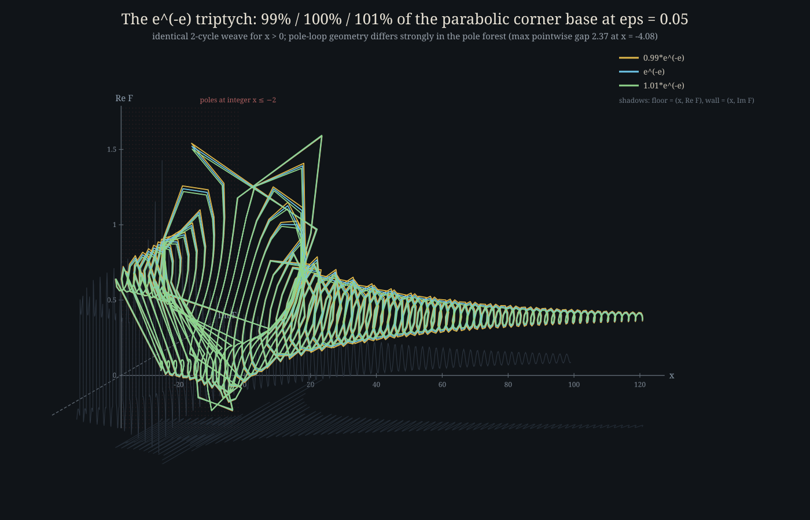
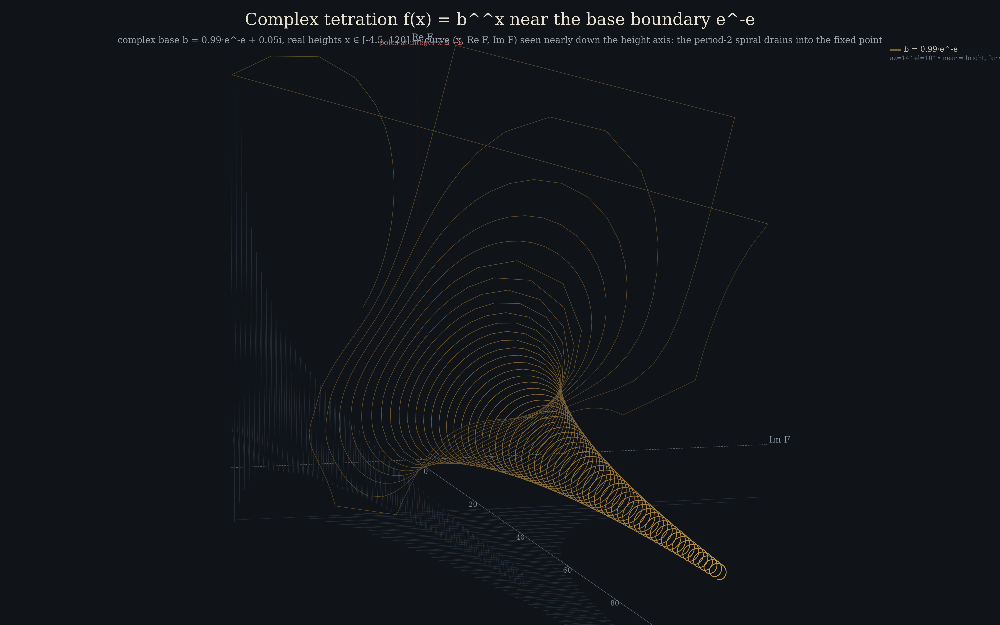

# `tet` — arbitrary-precision complex tetration

## 0. To the Tetration Forum — first, the credits

**This work exists because of, and for, the
[Tetration Forum](https://tetrationforum.org) community.** Nearly two
decades of open mathematics on that forum — constructions, proofs,
counterexamples, working code, and honest negative results — are the
foundation this implementation stands on. Before anything else, credit
where it belongs:

* **[bo198214 (Henryk Trappmann)](https://tetrationforum.org/member.php?action=profile&uid=1)** —
  founder of the forum, and co-author of the uniqueness theory for
  holomorphic Abel functions at complex fixed-point pairs that makes
  "*the*" canonical tetration a well-posed target at all.
* **Dmitrii Kouznetsov** — the Cauchy-integral construction
  (Math. Comp. 2009) that is the computational heart of this
  repository, developed and stress-tested in the open on the forum.
* **[sheldonison (Sheldon Levenstein)](https://tetrationforum.org/member.php?action=profile&uid=42)** —
  [fast accurate Kneser sexp algorithm](https://tetrationforum.org/showthread.php?tid=486),
  the [fatou.gp / merged-fixed-point program](https://tetrationforum.org/showthread.php?tid=1017),
  and the [complex-base tetration program](https://tetrationforum.org/showthread.php?tid=729)
  — for years the practical gold standard this project measures
  itself against.
* **[mike3](https://tetrationforum.org/member.php?action=profile&uid=56)** —
  the [Cauchy Integral Experiment](https://tetrationforum.org/showthread.php?tid=359)
  and [tetration for ALL bases, real and complex](https://tetrationforum.org/showthread.php?tid=828)
  threads, which map exactly the "cover the whole base plane"
  ambition (including the cut segment) pursued here.
* **[andydude (Andrew Robbins)](https://tetrationforum.org/member.php?action=profile&uid=2)** —
  the natural slog / Abel-matrix approach and
  [Designing a Tetration Library](https://tetrationforum.org/showthread.php?tid=146).
* **[Gottfried Helms](https://tetrationforum.org/member.php?action=profile&uid=9)** —
  the matrix (Carleman) operator school, including
  [fixpoint comparisons](https://tetrationforum.org/showthread.php?tid=83)
  directly relevant to this repo's fixed-point-pair machinery.
* **[jaydfox (Jay D. Fox)](https://tetrationforum.org/member.php?action=profile&uid=7)** —
  [accelerated slog via Abel-matrix inversion](https://tetrationforum.org/showthread.php?tid=1203).
* **[JmsNxn (James Nixon)](https://tetrationforum.org/member.php?action=profile&uid=163)** —
  the β-method and infinite-composition theory, and much of the
  forum's modern analytic energy.
* **[tommy1729](https://tetrationforum.org/member.php?action=profile&uid=47)**,
  **Ember Edison**, **MphLee**, and the many members whose questions,
  conjectures, and counterexamples shaped what "getting it right"
  means for every regime handled below.
* **William Paulsen & Samuel Cowgill** — whose complex-base papers
  grew from and fed back into these community discussions.

This repository's companion thread on the forum is
[Arbitrary Tetration in rust](https://tetrationforum.org/showthread.php?tid=1826)
(Computation board) — discussion, bug reports, and mathematical
critique are most welcome there or via GitHub issues.

---

**Tetration** `F_b(h)` — the analytic extension of the tower
`b^(b^(b^…))` of height `h` — for **complex bases** and **complex
heights**, using request-sized arbitrary-precision arithmetic in Rust.
Coverage is incomplete, and working precision is not a certified error bound.

```console
$ tet --quiet 50 2 0 0.5 0    # base 2, height 1/2
1.4587818160364217006839716610385871352966066053309
1.4385466959000460791684806773926427793264165481517e-69

$ tet --quiet 20 0.5 0 0.5 0  # real base below one; genuinely complex result
0.62978622839612487196
0.21786186312508402837
```

The solver portfolio attempts the method appropriate to each regime: special cases, Schröder
regular iteration at the attracting fixed point, Kouznetsov's
Cauchy-integral construction, warm-started continuation, and an experimental germ-tracked
ε-continuation walker for the branch-cut segment `0 < b < e^{−e}`.
Unchecked Richardson and linear-surrogate answers have been removed.
Finite-value, convergence, normalization and functional-equation checks reject
known failures. These checks do **not** prove forward accuracy, uniqueness, or
global canonicality; the functional equation can hold for a wrong reconstruction.
The 50-digit base-2 example agrees with an independent-method numerical reference;
its tiny imaginary part is numerical roundoff, not a mathematical imaginary part.

* **Language / deps:** Rust, [`rug`](https://crates.io/crates/rug)
  (GMP/MPFR/MPC bindings) for arbitrary-precision complex arithmetic,
  [`rayon`](https://crates.io/crates/rayon) for parallel kernels.
* **Interface:** a single CLI binary `tet`, plus a string-in/string-out
  library API (`tetration::tetrate_str`).
* **Definition used:** `F_b(0) = 1`, `F_b(z+1) = b^{F_b(z)}`, with
  method-specific branch and normalization conventions
  (§ [Conventions](#12-conventions-and-normalization)).
* **Status (October 2026 audit):** useful numerical coverage, not universal or
  certified tetration. Some near-parabolic, negative-real, general-complex and
  cut-base cases remain unsupported. See [`FAILURE_CASES.md`](FAILURE_CASES.md)
  and [`updates.md`](updates.md); August success claims are historical, not
  current accuracy guarantees.
* **License:** Apache-2.0.

---

## Table of contents

0. [To the Tetration Forum — first, the credits](#0-to-the-tetration-forum--first-the-credits)
1. [Mathematical background](#1-mathematical-background)
   1. [What tetration is](#11-what-tetration-is)
   2. [Conventions and normalization](#12-conventions-and-normalization)
   3. [The base-plane geography: Shell–Thron](#13-the-base-plane-geography-shellthron)
2. [Building from source](#2-building-from-source)
3. [Command-line usage](#3-command-line-usage)
4. [Library usage](#4-library-usage)
5. [Coverage map](#5-coverage-map)
   1. [✅ Verified](#51--verified)
   2. [⏳ Pending / in progress](#52--pending--in-progress)
   3. [❌ Known-bad / missing](#53--known-bad--missing-by-design-or-documented-ceiling)
   4. [Gallery: the cut segment in 3D](#54-gallery-fx--bx-near-the-cut-in-3d)
6. [The algorithms, in detail](#6-the-algorithms-in-detail)
   1. [Classification](#61-classification-fixed-points-and-)
   2. [Exact cases](#62-exact-cases)
   3. [Schröder regular tetration](#63-schröder-regular-tetration-shellthron-interior)
   4. [Kouznetsov Cauchy-integral method](#64-kouznetsov-cauchy-integral-method-outside-shellthron)
   5. [Continuation solver](#65-continuation-solver)
   6. [Retired polynomial fallback](#66-retired-polynomial-fallback)
   7. [The cut-base ε-walker](#67-the-cut-base-ε-walker-0--b--e−e)
7. [Numerical honesty](#7-numerical-honesty)
8. [Known limitations](#8-known-limitations)
   1. [Feasibility verdicts for the open gaps](#81-how-hard-would-closing-each-gap-be-feasibility-verdicts)
9. [Repository layout](#9-repository-layout)
10. [Testing](#10-testing)
11. [References](#11-references)

---

## 1. Mathematical background

### 1.1 What tetration is

Tetration is the fourth hyperoperation: iterated exponentiation. For a
non-negative integer height `n`,

```
b^^0 = 1,   b^^(n+1) = b^(b^^n)
```

so `2^^3 = 2^(2^2) = 16`. The interesting problem — the one this
project addresses — is extending `h ↦ b^^h` to **arbitrary complex
heights** `h` and **arbitrary complex bases** `b`, holomorphically,
satisfying

```
F_b(0) = 1        (normalization)
F_b(z+1) = b^F_b(z)   (the Abel / functional equation, "FE")
```

The FE and normalization alone do not determine a unique function:
reparameterizations `h ↦ h+p(h)` with suitable 1-periodic `p` preserve the FE.
Kneser-type uniqueness requires additional analytic hypotheses, not just
agreement of two numerical runs. For example, Trappmann–Kouznetsov's Abel
criterion requires an injective holomorphic Abel function on an initial
region, a normalization, and coverage of the complex plane by integer
translates of its image. This implementation does not verify that criterion.
For the real-base Kneser construction above `e^{1/e}`, the selected solution
is real on `h ∈ (−2,∞)` and has specified limiting fixed points.

### 1.2 Conventions and normalization

Precise statements of what `tet` returns:

* **Normalization:** `F_b(0)=1`, `F_b(1)=b`, `F_b(−1)=0` for nondegenerate
  bases. A finite `F_b(−2)` would require an exponential to equal zero, so
  it cannot exist. The program rejects integer heights `≤−2`; it does not
  return an infinity as a successful complex value. Base one is a separate
  constant-function convention, including at negative heights.
* **Branches:** `b^z=exp(z·Log(b))` uses the principal base logarithm.
  Height reduction uses principal logs; experimental contour continuation
  can use explicitly tracked logarithmic branches. A global single-valued
  function on all heights is not claimed.
* **Real bases above one:** regular attracting iteration is used where
  available below `e^{1/e}`; the Kneser-type Cauchy construction is used
  above it. Real-height reality checks apply on the relevant real domain,
  not to every real base or every height.
* **Real bases below one:** the selected regular branch is generally
  complex at noninteger real heights because `λ^h` has `λ<0`. For example,
  `F_0.5(0.5)≈0.6297862284+0.2178618631i`; forcing its imaginary part to zero
  is incorrect. This specifies the chosen regular branch, not a
  nonexistence theorem about every other possible real interpolation.
* **`Im(b)<0`:** the dispatcher defines the reflected branch by
  `F_b(h)=conj(F_conj(b)(conj(h)))`.
* **Cut segment `0<b<e^{−e}`:** the intended experimental convention is
  continuation from the upper half base-plane. Neither existence of every
  required boundary limit nor a successful endpoint solve has been
  established by this audit.
* **Integer heights:** direct MPFR/MPC tower iteration, not exact symbolic
  arithmetic in general. Exact representable cases such as `2^^3=16`
  remain exact; exponent-range overflow/underflow is an error.

### 1.3 The base-plane geography: Shell–Thron

For the map `f(z) = b^z`, a distinguished fixed point is

```
L = −W₀(−ln b) / ln b,     with multiplier   λ = f'(L) = L · ln b
```

where `W₀` is the principal Lambert W branch. The **Shell–Thron
region** is the set of bases with `|λ| ≤ 1` — a cardioid-like domain
in the base plane. Its boundary crosses the real axis at
`η = e^{1/e} ≈ 1.44467` (where `λ = 1`, the parabolic case famous from
`b^^∞` convergence) and at `e^{−e} ≈ 0.06599` (where `λ = −1`, the
period-doubling point). The geography drives everything:

| where `b` lives | dynamics at `L` | natural method |
|---|---|---|
| Shell–Thron interior (`\|λ\| < 1`) | attracting | Schröder linearization |
| Shell–Thron boundary (`\|λ\| = 1`) | root-of-unity or irrationally neutral | sectorial Fatou coordinates / small-divisor analysis; not generally implemented |
| outside, real `b > η` | repelling, conjugate FP pair | Kouznetsov Cauchy integral |
| outside, general complex `b` | repelling fixed points | experimental Kouznetsov pair selection; no global coverage guarantee |
| real cut `0 < b < e^{−e}` | repelling with `λ < −1` | ε-continuation walker (this repo's construction) |

---

## 2. Building from source

The project is plain Cargo, but `rug` compiles the GNU bignum stack
(GMP, MPFR, MPC) from source the first time, which needs a C toolchain.

### 2.1 Prerequisites

* **Rust** stable compatible with `Cargo.lock` (no tested minimum version is declared): install via
  [rustup.rs](https://rustup.rs) —
  `curl --proto '=https' --tlsv1.2 -sSf https://sh.rustup.rs | sh`
* **C toolchain + m4** (for the `gmp-mpfr-sys` build):
  * Debian/Ubuntu: `sudo apt install build-essential m4 diffutils`
  * Fedora: `sudo dnf install gcc make m4 diffutils`
  * macOS: `xcode-select --install` (m4 ships with the CLT)
  * Windows: use **WSL** (the MSVC target is not supported by
    `gmp-mpfr-sys`; MinGW works but WSL is the documented path)

### 2.2 Build, test, install

```console
$ git clone https://github.com/lukaszgryglicki/claude-tetration
$ cd claude-tetration
$ cargo build --release          # first build compiles GMP/MPFR/MPC: ~2-5 min
$ ./target/release/tet --quiet 50 2 0 3 0
16
0
```

Run the test suite (release mode strongly recommended — the numeric
tests are heavy):

```console
$ TET_MT=4 cargo test --release --all-targets -- --test-threads=1
$ cargo test --release --lib     # just the fast unit tests
```

Optionally place the binary on your `PATH`:

```console
$ cargo install --path .         # installs `tet` into ~/.cargo/bin
```

No configuration files, no runtime dependencies beyond the shared
system libc: the bignum stack is statically linked into the binary.

### 2.3 First-run sanity checks

```console
$ tet 50 2 0 3 0        # integer tower: exactly 16
$ tet 20 2.718281828459045235 0 0.5 0    # e^^0.5 ≈ 1.6463542337...
$ tet 20 1.4142135623730950488 0 0.5 0    # √2, inside Shell-Thron
1.2436216276685218043
$ tet 20 0 1 0.5 0      # base i
1.1667009135704745693
0.73456353698672132966
```

---

## 3. Command-line usage

```
tet [--quiet|--silent|-q] <precision_digits> <base_re> <base_im> <height_re> <height_im>
```

* `precision_digits` — requested decimal precision (positive integer).
  Internally mapped to MPC binary precision with guard bits.
* the four remaining arguments are decimal strings for
  `b = base_re + i·base_im` and `h = height_re + i·height_im`.

**Output:** two lines on stdout — `Re F_b(h)`, then `Im F_b(h)`.
**Exit codes:** `0` success; `1` honest failure (diagnostic on stderr);
`2` usage error.

Detailed algorithm and iteration diagnostics go to stderr **by default**.
Quiet flags or a truthy `SILENT` suppress progress, never fatal errors.

| variable | effect |
|---|---|
| `SILENT=1` | suppress progress diagnostics; fatal errors remain on stderr |
| `TET_KOUZ_ANDERSON=1` / `TET_KOUZ_PICARD=1` | force alternative Kouznetsov iterators (diagnostics) |
| `TET_KOUZ_NO_EM=1`, `TET_KOUZ_EM_K=<n>` | Euler–Maclaurin correction A/B switches |
| `TET_KOUZ_CUT_ANCHOR=<ε₀>`, `TET_KOUZ_CUT_RATIO=<r>` | positive anchor (default 2), ratio strictly between 0 and 1 (default 0.72); oversized schedules are rejected |
| `TET_KOUZ_CUT_CKPT=<file>` | atomic full-precision `TETCKPT2` checkpoints; exact base/precision/geometry matching is required. Corrupt, incompatible `TETCKPT1`, and I/O failures are errors, not silent cold starts |
| `TET_KOUZ_UNWRAP_DEBUG=1` | branch-unwrap winding diagnostics |
| `TET_KOUZ_RESID_DUMP=<prefix>` | full-precision residual profiles under the supplied prefix; collisions and I/O failures are reported |
| `TET_MT=<n>` | unset/empty/`0`: serial; `1`: available cores; `n ≥ 2`: exactly `n` threads. Invalid settings or an already-initialized conflicting Rayon pool are errors, including for library callers |

**MT mode.** Big-number tetration is dominated by one hot loop: the FFT-based
Newton–Krylov matvecs inside the Kouznetsov solver (measured ≈ 90 % of a
20-digit cut-adjacent solve). With `TET_MT` set, the radix-2 FFT runs its
butterflies in parallel over disjoint index pairs, and the per-node
transcendental maps (`b^F`, branch logs, boundary corrections) run as parallel
element-wise maps. **No floating-point accumulation is ever reordered** —
GMRES inner products, norms and Euler–Maclaurin sums stay serial, and each
parallel output element is produced by the same correctly-rounded MPC
operations on the same operands in the same order as the serial code. MT-mode
results are therefore bit-identical to the default, verified by A/B `diff` on
Kouznetsov, Schröder and complex-base cases. Speedup is workload-dependent:
grids of `n = 4096–32768` nodes at modest precision parallelize well; tiny
grids and pure-Schröder evaluations gain little. Measured on a 16-core box
(`tet 30 2 0 0.5 0`, a historical 30-digit Kouznetsov solve, machine under background
load, values `diff`-identical): serial 732 s → `TET_MT=4` 362 s (2.0×) →
`TET_MT=16` 167 s (**4.4×**). These timings are not current performance
guarantees. The retired Richardson ladder no longer launches parallel solves.

Examples:

```console
$ tet --quiet 10 -2 0 0.4 0.1           # explicit unsupported/residual error,
                                       # nonzero exit, no numeric stdout

$ SILENT=1 tet 20 1.4142135623730950488 0 0.5 0   # √2, quiet mode
1.2436216276685218043
0

$ tet 20 0.04 0 0.5 0                   # experimental cut walk; may take hours
```

---

## 4. Library usage

The crate exposes the same functionality as a library:

```rust
// Cargo.toml:  tetration = { git = "https://github.com/lukaszgryglicki/claude-tetration" }

fn main() -> Result<(), String> {
    // string-in / string-out, precision in decimal digits
    let (re, im) = tetration::tetrate_str("30", "2", "0", "0.5", "0")?;
    println!("2^^0.5 = {re} + {im} i");
    Ok(())
}
```

The string API, CLI and grid runner include supplied significant decimal
digits when choosing working precision, without changing requested output
digits. This prevents a near-one base, fractional height or huge odd integer
from rounding into a different exact special case before dispatch. Redundant
padding and exponent text do not inflate that significand count.

Lower-level entry points (`dispatch::tetrate`, per-method `setup_*` /
`eval_*` pairs that amortize per-base work across many heights) are
public as well; see the module docs in `src/`.

---

## 5. Coverage map

Selected coverage, not a partition into universally solved classes.
Every row is subject to branch, domain, convergence and resource limits:

| base class | heights | method | accuracy / status |
|---|---|---|---|
| `b = 0`, `b = 1` | integer / all | exact special case | exact |
| nondegenerate `b` | integers `h ≥ −1` within iteration/exponent limits | direct iteration | finite-precision arithmetic; exact special cases |
| attracting regular cases (`√2`, `0.5`, `i`, `1.3+0.1i`, …) | tested complex heights | Schröder | independent 50/70-digit witnesses; not all-height coverage |
| real `b > η` | heights within the reconstruction domain | Schwarz-symmetric Kouznetsov | base-2 half-height has an independent 50-digit cross-check |
| general complex outside ST | case-dependent | experimental Kouznetsov / regular iteration | failures include `−2` and `−0.8+0.4i`; no class-wide accuracy certificate |
| `Im(b) < 0` | reflected domain | Schwarz convention | same numerical limitations as the reflected case |
| boundary band `0.95 ≤ \|λ\| ≤ 1.05` | case-dependent | regular iteration, continuation, direct Kouznetsov | b=1.5 has a converging direct route; near-parabolic examples refuse |
| real cut segment `0 < b < e^{−e}` | case-dependent | regular branch where available; experimental ε-walker otherwise | no verified walker endpoint in this audit |
| `b=0` outside nonnegative integer heights; nondegenerate `b` at integer `h≤−2` | — | error | base one retains its constant-function convention |

### 5.1 ✅ Verified

Numerically cross-checked, **not interval-certified**:

* Six independent regular-iteration references at both 50 and 70 digits:
  `b=1.2, h=0.4+0.2i`; and `h=0.5` for `b=0.5`, `1.3+0.1i`, high-precision
  `√2`, `i`, and `0.99·exp(−e)+0.05i`. A separate 260-decimal-digit mpmath
  forward-orbit/log-unwinding construction stabilized beyond 85 digits at
  two orbit depths. The CLI components matched their requested rounding.
  [`tests/phase10_honesty.rs`](tests/phase10_honesty.rs) preserves the
  references at 1/10/50/70 digits and lower-half-plane checks at 50 digits.
* For `b=2, h=0.5`, a 50-digit Kouznetsov output differs relatively by
  `4.90e-51` from the independently constructed fatou.gp reference in
  [gp-tetration's values.json](https://github.com/Lightrunnerwastaken/gp-tetration/blob/main/research/reference/values.json).
  The older `1.4587818160364217112` anchor was inaccurate after about 16 digits.
* Lambert branch identity/conditioning, FFT roundtrips and ST/MT bit identity,
  residual decisions, checkpoints and numerical tolerances include
  50/70/1000-digit checks. Primitive tests alone do not establish
  1000-digit noninteger tetration coverage.
* Exact base `-1` stays exactly `-1` at every supported positive integer
  height. The 50/70/1000-digit regressions prevent repeated log/exp roundoff
  from being amplified at this repelling fixed point.
* Decimal inputs longer than the requested output precision retain their
  exact domain/parity decisions, including 1000-digit requests. Regressions
  cover the string API, actual CLI error/output shape, grid axes, exponent
  notation and ST/MT identity.

Maintainer-local audit evidence (full logs, independent reference generator
and snapshots) is retained in `~/tetration-audit-2026-10-04-artifacts/`, including
`oct-independent-regular.jsonl`, `oct-final-base2-50-check.json` and
`oct-input-rounding-before.log`/`oct-input-rounding-after.log`. These local files
are not committed gallery data; the portable reference fixtures are in the tests.
`oct-input-cli-grid.json` records the actual input-domain/ST-MT checks, and
`oct-post-input-references.json` rechecks independent 50/70-digit rounding
after the input-aware precision repair.
The detailed audit and deferred implementation sequence are in
`~/tetration-audit-2026-10-04-1.md`; committed-source reproduction evidence
includes `oct-committed-b146.log` and `oct-committed-source.tar`.

### 5.2 ⏳ Pending / in progress

The cut-walker endpoint, robust near-parabolic constructions, difficult
complex-base contours and validated forward-error bounds remain research work.
No old walk was restarted for the October audit. A small positive imaginary
part does not guarantee a solvable or accurate near-cut case.

### 5.3 ❌ Known-bad / missing (by design or documented ceiling)

* **Near-parabolic cases**, including `b=1.4448`: the former fixed-ladder
  Richardson result had no requested-accuracy contract and is now an error
  when existing convergent methods fail. The whole routing band is not
  mathematically parabolic, nor uniformly unsupported.
  Rebuilding committed revision `26aec7f` also disproved the old `b=1.46`
  full-precision continuation claim: its first warm step stalls, then the
  old code returns unchecked extrapolation. t880 now requires honest refusal
  from both failed solver paths; see [the failure atlas](FAILURE_CASES.md).
* **Complex bases close to |λ|=1** (`|λ| ≳ 0.99`, e.g.
  `b = 0.0653 + 0.025i` with `|λ| = 0.995`): Schröder correctly
  refuses its convergence checks, the Kouznetsov LM iteration stalls at an O(1)
  residual.
  Since the honesty gate (§ 7) rejects stalled solves, these bases
  **ERR cleanly** instead of returning plausible-looking garbage.
  (Before the gate, one such stalled solve produced values that
  diverged to `∞` under upward iteration while the true orbit is
  bounded — caught during the § 5.4 chart campaign and now a
  regression case.)
* **Outside-ST bases with unresolved contour/branch obstructions**
  (discovered on `b = −0.8 + 0.4i`, `|λ| ≈ 1.15`): the LM solve stalls
  at an O(1) residual that is partly a *phantom* (principal-log
  branch break on the left edge — the two-sided unwrap drops it
  1.577 → 9.5e-4) and partly *genuine* (the remaining 9.5e-4 floor is
  node-count-invariant and spatially broad. A zero or branch obstruction
  in the strip is a diagnosis to investigate, not a nonexistence proof
  from a finite residual or a sampled minimum of `|F|`).
  **There is no independently verified tetration value at such bases
  yet**: an earlier test-blessed 20-digit value turned out to be a
  discretization artifact — 20/22/25-digit runs each give a
  *completely different* `F(0.5)` while all passing the (recurrence-
  enforced, hence tautological) FE post-check. The honesty gate now
  rejects all of them and the CLI ERRs cleanly; the regression tests
  assert the refusal. Principal and two-sided retries may still be expensive;
  no unchecked extrapolation follows them.
  Full anatomy: `FAILURE_CASES.md` § A.2.
  Closing this class needs a non-rectangular (Paulsen-style) contour
  that avoids the in-strip zero of `F` — a research item (§ 8.1).
* **`b = 0` at non-integer heights** — no principal-branch value
  exists: honest ERR.
* **Negative integer heights `h ≤ −2`** for nondegenerate bases: no finite
  value consistent with the recurrence through `F(−1)=0`; honest error.
* **Paulsen–Cowgill conformal-map machinery** — not implemented;
  pathological bases that would need it error out cleanly instead of
  guessing.

### 5.4 Gallery: `f(x) = b^^x` near the cut, in 3D

**Historical August illustrations, not accuracy certificates.** The existing
CSVs/SVGs/JPGs were not regenerated in the October audit. They sample finite
`Im(b)=0.05`, not the real cut or a proven `ε→0` limit. Interpolated line
segments, apparent circles and error-free sweeps do not prove the mathematics.

What does tetration *look like* for a base just below `e^{−e}`? Since
`f(x)` is complex even for real `x` there, the natural picture is a
**3D curve** `x ↦ (x, Re f, Im f)`. The charts below sweep real
heights `x ∈ [−30, 120]` (~1000 adaptive points per base, denser in
the interesting bands) for `b` at 99%, 100% and 101% of `e^{−e}`,
each evaluated at `b + 0.05i` — the uniform-`iε` preview of the cut
limit (the § 6.7 walker attempts the endpoint; it has not verified it).

| chart | file |
|---|---|
| `b = 0.99·e^{−e}` | [`docs/charts/tet3d_b099eme_eps005.svg`](docs/charts/tet3d_b099eme_eps005.svg) |
| `b = e^{−e}` exactly | [`docs/charts/tet3d_b100eme_eps005.svg`](docs/charts/tet3d_b100eme_eps005.svg) |
| `b = 1.01·e^{−e}` | [`docs/charts/tet3d_b101eme_eps005.svg`](docs/charts/tet3d_b101eme_eps005.svg) |
| all three overlaid | [`docs/charts/tet3d_triptych_eps005.svg`](docs/charts/tet3d_triptych_eps005.svg) |
| `ε`-convergence (`0.1` vs `0.05`) | [`docs/charts/tet3d_b099eme_eps_convergence.svg`](docs/charts/tet3d_b099eme_eps_convergence.svg) |



#### The dense multi-view gallery

The five charts above were first drafts at ~1000 points: enough to
find the phenomena, far too coarse to *see* them — the period-2 weave
winds approximately once per `Δx = 2`, so a `0.25` step leaves conspicuous
polygonal segments. The gallery below used denser sweeps of all
three bases at **5× density (~5070 points per base)** and renders
them with a real turntable camera ([`scripts/plot3d.py`](scripts/plot3d.py)
v2: orthographic 3D rotation, painter-sorted depth shading, and an
**isotropic complex plane** — `Re F` and `Im F` share one scale, so
the picture does not introduce unequal Re/Im scaling; it does not establish
that the underlying curves are circles).



| view | file |
|---|---|
| **hero raster (JPG, share-ready)** — near-axial vortex view, `b = 0.99·e^{−e}`, `x ∈ [−4.5, 120]` | [`docs/charts/tet3d_hero.jpg`](docs/charts/tet3d_hero.jpg) |
| oblique full sweep, `b = 0.99·e^{−e}` | [`docs/charts/tet3d_b099eme_dense.svg`](docs/charts/tet3d_b099eme_dense.svg) |
| oblique full sweep, `b = e^{−e}` | [`docs/charts/tet3d_b100eme_dense.svg`](docs/charts/tet3d_b100eme_dense.svg) |
| oblique full sweep, `b = 1.01·e^{−e}` | [`docs/charts/tet3d_b101eme_dense.svg`](docs/charts/tet3d_b101eme_dense.svg) |
| oblique overlay, all three | [`docs/charts/tet3d_triptych_dense.svg`](docs/charts/tet3d_triptych_dense.svg) |
| turntable `az = 12°/55°/75°/90°` | [`…az12`](docs/charts/tet3d_b099eme_az12.svg) · [`…az55`](docs/charts/tet3d_b099eme_az55.svg) · [`…az75`](docs/charts/tet3d_b099eme_az75.svg) · [`…az90`](docs/charts/tet3d_b099eme_az90.svg) |
| high camera (`el = 62°`) | [`docs/charts/tet3d_b099eme_top.svg`](docs/charts/tet3d_b099eme_top.svg) |
| **the weave end-on** (down the `x` axis) | [`docs/charts/tet3d_b099eme_endon_weave.svg`](docs/charts/tet3d_b099eme_endon_weave.svg) |
| the weave end-on, three bases overlaid | [`docs/charts/tet3d_triptych_endon_weave.svg`](docs/charts/tet3d_triptych_endon_weave.svg) |
| the pole forest end-on (nested loop rosette) | [`docs/charts/tet3d_b099eme_endon_forest.svg`](docs/charts/tet3d_b099eme_endon_forest.svg) |
| weave close-up `x ∈ [2, 40]` | [`docs/charts/tet3d_b099eme_weave_closeup.svg`](docs/charts/tet3d_b099eme_weave_closeup.svg) |
| pole-forest close-up `x ∈ [−9, 0]` | [`docs/charts/tet3d_b099eme_forest_closeup.svg`](docs/charts/tet3d_b099eme_forest_closeup.svg) |
| the seam `x ∈ [−3, 12]` | [`docs/charts/tet3d_b099eme_seam.svg`](docs/charts/tet3d_b099eme_seam.svg) |

The end-on views (`az = 0`) look straight down the height axis, so
the curve collapses onto the complex plane and you see exactly what
the orbit does there: the **weave is a logarithmic-style spiral**
hugging the period-2 alternation as it drains into the fixed point,
and the **"pole forest" is a nest of widening loops** around singular-height
breaks. This historical nickname does not classify every singularity as a pole.
These are the "swirling circles" hiding inside the oblique views.

Historical numerical observations from the CSVs in
[`docs/charts/data/`](docs/charts/data/) (3 × 1015 + 256 points,
**zero solver errors**):

* **Singular-height region** (`x ≲ −2`): integer heights `≤−2` are
  excluded by the finite-value recurrence contract for these bases.
  The old sweep displaced samples by `+0.013`; it did not verify the
  singular points themselves or establish that they were all poles.
* **2-cycle weave** (`x ≳ 2`): the fixed-point multiplier is
  `λ ≈ −0.98` (nearly parabolic, *negative*), so the orbit converges
  by slowly-damped **period-2 alternation** — a helix that tightens
  around `L ≈ 0.376 + 0.048i` and is still visibly braided at
  `x = 120`.
* **The three bases are nearly indistinguishable at `ε = 0.05`** on
  `x > 0` (pointwise gap `< 0.02` there); they differ materially only
  inside the pole loops (max gap 2.37 at `x = −4.08`). The famous
  qualitative divide at `b = e^{−e}` (convergence vs 2-cycle on the
  real line) emerges **only in the `ε → 0` limit** — which is
  precisely why the § 6.7 walker exists.
* **The `ε`-convergence overlay uses `0.1` vs `0.05`** (both
  Schröder-verified): halving ε moves the curve by up to 1.80 in the
  pole forest, 0.64 near the seam (`x = 2.2`) and 0.13 out at
  `x > 50` — a strong, *non-uniform* ε-dependence. The
  originally-planned `ε = 0.025` level sits deep in the parabolic
  band (`|λ| = 0.995`) where the solver now honestly ERRs (§ 5.3) —
  the first attempt at that sweep is what exposed the acceptance-gate
  bug described there.

The corrected [`scripts/chartgen.sh`](scripts/chartgen.sh) uses exact
decimal-derived rational heights, including negative integers, with at most
four outer workers (one when inner MT is enabled). Its fourth argument is a
positive step multiplier (`0.2` gives denser sampling). Failed samples remain
as `ERR` rows with reasons in `<output>.errors.log`; **any failed sample makes
the command exit nonzero**, including expected singularities.
[`scripts/plot3d.py`](scripts/plot3d.py) renders CSV to SVG; use
`--xrange=-30:-3` for negative ranges and `--break-negative-integers` for
known nondegenerate tetration curves. Gaps are never joined across those
singular heights. [`scripts/chartgallery.sh`](scripts/chartgallery.sh) enables
these breaks and uses `rsvg-convert` plus ImageMagick for JPG output.

---

## 6. The algorithms, in detail

This section is written for readers who want to check the mathematics
or port the ideas. Each subsection names the implementing module.

### 6.1 Classification: fixed points and λ (`src/regions.rs`, `src/lambertw.rs`)

For `b ∉ {0, 1}` compute `L = −W₀(−ln b)/ln b` and `λ = L·ln b` in
full working precision (Lambert W by Halley iteration with branch checks and
extra internal precision near `−1/e`, `src/lambertw.rs`). Classify by `|λ|` with a guard
band: interior `< 0.95`, boundary band `0.95…1.05`, outside `> 1.05`
(split into real-positive and general-complex arms). The band exists
because Schröder's geometric convergence rate is `|λ|` — uselessly slow
near 1 — and the Kouznetsov contour height blows up like
`1/|arg λ|` there.

### 6.2 Exact cases (`src/integer_height.rs`, `src/dispatch.rs`)

`b = 1 → 1`; `b = 0` alternates `1, 0, 1, …` on non-negative integers;
integer heights iterate `b^·` (or `log_b` for negative heights down to
`h = −1`) in rounded big-float arithmetic. Range failures are errors.
These paths bypass analytic continuation; independent algebraic identities
provide stronger tests than comparing two copies of the same tower loop.

### 6.3 Schröder regular tetration (Shell–Thron interior) (`src/schroder.rs`)

At an attracting `L` (`|λ| < 1`), Schröder's equation
`σ(f(z)) = λ·σ(z)`, `σ(L) = 0`, `σ'(L) = 1` linearizes the dynamics.
With `σ̃(w) = σ(L + w)`:

```
F_b(z) = L + σ̃⁻¹( σ̃(1 − L) · λ^z )
```

satisfies the FE analytically and `F_b(0) = 1` exactly. The
implementation computes σ̃ Taylor coefficients from the recursion

```
c_N (λ^N − λ) = − Σ_{n=1}^{N−1} c_n λ^n [w^{N−n}] q(w)^n,
h(w) = (b^{L+w} − L)/λ = w·q(w),  q_j = (ln b)^j/(j+1)!
```

then reverts the series for σ̃⁻¹ and evaluates by Horner. Two shift
mechanisms extend the reach when Taylor disks are too small:
a **σ̃-shift** (iterate the dynamics toward `L` until inside the disk,
compensating by powers of λ) and an **h-shift** (evaluate at `z + k`,
then apply `b^·` or `log_b` exactly `k` times). The same machinery,
run at a **repelling** fixed point with backwards iteration, handles a
fringe of bases just outside the boundary. A real-base branch guard (§ 7)
rejects the known mismatch between repelling regular iteration and real-base
Kneser tetration; it is not a general canonicality proof.

### 6.4 Kouznetsov Cauchy-integral method (outside Shell–Thron) (`src/kouznetsov.rs`)

The main alternative outside the regular-iteration region. The intended
branch is sought through a vertical-line boundary problem: sample `F` at `N` uniform nodes on
`Re z = 1/2`, `t ∈ [−T, T]`, and refine by Cauchy's integral over the
rectangle `Re ∈ [−1/2, 3/2]`, `Im ∈ [−T, T]` whose four edges are
known in terms of the samples themselves:

* right edge: `F(3/2 + it) = b^{F(1/2+it)}` (the FE forward),
* left edge: `F(−1/2 + it) = log_b F(1/2+it)` (the FE backward, with a
  pointwise principal log or an explicitly selected two-sided unwrap),
* top/bottom edges: limiting fixed points `L_upper` / `L_lower` used as
  finite-contour boundary approximations, not exact finite-height values.

For real `b > η` the pair is `(L, L̄)` (Schwarz-symmetric, each iterate
re-symmetrized); for complex bases the pair comes from the `W₀` and
`W₋₁` Lambert branches, in opposite half-planes, with an automatic
partner search. Discretization: trapezoid with tail truncation set by
the decay rate `|arg λ|` (`T ≈ (digits+8)·ln10 / |arg λ|`), node count
scaled to keep the analyticity-strip resolution, plus an
**Euler–Maclaurin boundary correction** for the O(h²) edge error. The
integral-equation Jacobian is applied via **FFT cross-correlation**
(`src/fft.rs`, O(N log N) matvecs), and the nonlinear system is solved
by **diagonally regularized Newton–Krylov** with multi-start
retries (Anderson-accelerated Picard available as a diagnostic
fallback). It solves `(J+μI)δ=r`, not least-squares Levenberg–Marquardt;
the historical “LM” log label is retained. Increasing μ is not guaranteed
gradient descent, and a stall does not establish a discretization error.
Converged samples are then normalized: a Newton search
finds the shift δ with `F(δ) = 1`, and heights are evaluated by one
final Cauchy application plus rounded integer FE steps.

The boundary residual and FE check are consistency gates, **not certified
forward-error bounds**. Error certification would additionally require
conditioning, discretization/tail, roundoff and branch/uniqueness control.
The existing Euler–Maclaurin coefficient table has 20 terms; arbitrary
working precision does not remove this or the contour/node limits.

### 6.5 Continuation solver

Some near-parabolic bases defeat cold starts. The continuation solver
walks from a comfortably-solvable base toward the
target along a path in the base plane, warm-starting each Kouznetsov
solve by Cauchy-resampling the previous solution onto the new grid.
It is intended to help the `|λ| ≈ 1.05…1.10` fringe and underlies the
cut-base walker below, but does not guarantee convergence.

### 6.6 Retired polynomial fallback

The former five-level iε Richardson table returned answers even when its
levels disagreed and no requested-accuracy bound existed. It is removed.
`linear_approx::tetrate_linear` is a deprecated error-only compatibility
entry point. Numerical seeds, convergent series and quadrature remain part
of the analytical solvers; a seed or a fixed polynomial substitute is not
returned as tetration merely because it looks plausible.

At the real routing boundary, continuation is tried before the existing
direct Kouznetsov method. A failed continuation must not suppress a converging
direct solve (regression: `b=1.5`). If both fail, their causes are reported.

### 6.7 The cut-base ε-walker (`0 < b < e^{−e}`)

The most delicate regime, and this repository's original
contribution. On the cut segment the intended branch is a boundary
limit from `Im b > 0` (§ 1.2), where that limit exists. The germ of the chosen fixed-point
pair, continued from the anchor `b + 2i` down to the real axis, is
`(W₀, W₊₁)` — **both in the closed upper half-plane** (the generic
opposite-half-plane search rightly rejects such a pair, so the walker
injects it directly). The construction:

1. **Anchor** a clean bi-asymptotic Kouznetsov solve at `b + 2i`.
2. **Walk ε ↓ 0** along `b + iε` on a geometric schedule with
   adaptive bisection, warm-starting each solve from the previous
   curve and tracking the fixed-point pair by continuity
   (germ tracking — never re-picking branches from scratch).
3. **Two-sided anchored log-unwrap**: the left-edge integrand
   `log_b F` needs a branch that is continuous along the sample curve
   even when it crosses `(−∞, 0]` — which it always does near the cut
   since `Re L_lower < 0`. The unwrap is anchored at both asymptotic
   ends. This mode is also available as a retry for ordinary complex-base
   solves; passing either residual gate does not prove branch uniqueness.
4. **Homotopy walls and winding jumps.** Between the two Shell–Thron
   crossings of the path (`ε ≈ 1.55 → 0.08` at `b = 0.04`), a **zero
   of F drifts along the sample line**, so the discrete curve
   `t ↦ F(1/2 + it)` changes winding class around 0 as ε descends. A
   warm start in the wrong class stalls the solver ("no descent"). The
   walker recovers by multiplying the warm profile with smooth phase
   correctors `exp(±2πi·ramp(t − t_pinch))` — inserting a winding loop
   at up to **three detected pinch points** (well-separated interior
   local minima of `|F|`), singly and in sign pairs; near the cut
   several zeros straddle the line simultaneously and the true class
   is only reachable by a multi-pinch corrector (observed and fixed at
   `ε ≈ 0.196`, `b = 0.06`: winning combo `(−1 @ t=−29.4, +1 @ t=+46)`).
5. **Adaptive node boost.** When a zero sits within ~0.1 of the line
   (deep pinch, `|F|_min < 0.12`), the `ln F` integrand is
   near-singular and the trapezoidal error floor rises to the
   acceptance gate; the walker doubles the node count for those steps
   (observed and fixed at `ε ≈ 0.102`, `b = 0.06`: clean convergence
   flooring at 1.02e-8 on n=4096, cured by n=8192). Static tiers are
   not always enough: at `ε ≈ 0.068` a clean quadratic descent floored
   at 2.0e-8 with `|F|_min` just *above* the deep-pinch threshold, so
   the walker now also **escalates reactively** — a rejected solve
   whose residual is a *near-miss* (within 3 decades of the gate,
   i.e. a resolution floor, not an O(0.1–1) ghost stall) is retried
   once at doubled node tier before bisection.
6. **Ghost filtering and gates.** The discrete system admits spurious
   1-periodic-dressed near-solutions ("ghosts"). Defenses, all
   load-bearing and all documented from walk evidence: winding jumps
   are only allowed on **tight steps** (< 2% of ε); every accepted
   candidate must pass an internal residual gate
   `≤ 10^{−0.4·digits}` (1e-8 at 20 digits — decades above
   observed true-continuation conditioning floors, 18× below the
   nearest observed wrong-family stall). These are heuristic warm-state
   filters, not a proof against wrong branches. Internal candidates above
   `10^{−(digits+1)}` are diagnosed; a failed step
   bisects, and a walk that cannot proceed **fails honestly** rather
   than continuing on a suspect state.
7. The `ε=0` endpoint must meet the full `10^{−(digits+3)}` boundary
   target, normalize the actual returned reconstruction, and pass the
   finite/domain/FE checks. Relaxed internal candidates are not answers.
8. **Checkpoint/resume** (`TET_KOUZ_CUT_CKPT=<file>`). Deep walks are
   multi-hour; a crash or timeout used to lose everything (one 7-hour
   walk died mid-solve at `ε ≈ 1.006`). With a checkpoint file set,
   every accepted step serializes the full continuation state (base,
   digits, ε, both branch args, `t_max`, fixed-point pair, all nodes/
   weights/samples at full precision) atomically; a restart with the
   same `b`, digits and working precision resumes from the saved frontier — the anchor
   and already saved steps are reused. `TETCKPT2` preserves every scalar
   at full precision. Mismatched/corrupt/old-format checkpoints and I/O
   failures are explicit errors; only a missing file permits a cold start.

Historical status: August walks reached a recorded frontier
`ε ≈ 0.068` at `b = 0.06`, from `0.92` at
the start of that campaign (reported fixes included winding
jumps at `ε ≈ 0.196`, static deep-pinch boost at `ε ≈ 0.102`,
reactive near-miss escalation at `ε ≈ 0.068`). Walk
logs and the failure-mode history are in
[`updates.md`](updates.md) and
[`FAILURE_CASES.md`](FAILURE_CASES.md) § J. The October audit did not
rerun these walks or verify their historical intermediate values or endpoint.

---

## 7. Numerical honesty

* **No surrogate answers:** no fixed-ladder Richardson, linear substitute,
  or limiting fixed point returned for an unchecked finite height.
* **Finite/domain checks:** NaN/infinity, numerical overflow/underflow and
  known singular integer heights are errors, including in cached evaluators.
  Input parsing and direct API precision contracts are checked.
* **Actual normalization:** the same integer-extended reconstruction used for
  returned values must satisfy `F(0)=1`; a root of an unrelated raw
  extrapolant is insufficient. Cached Kouznetsov evaluation checks the base.
* **Residual contract:** a final Kouznetsov state must meet
  `10^{−(digits+3)}`. Relaxed walker candidates cannot become successful final
  answers just by printing an accuracy warning. GMRES checks the actual
  linear residual, not only its Arnoldi estimate.
* **FE consistency, not proof:** the evaluator checks a precision-scaled
  recurrence residual. Kouznetsov normally checks the predecessor so a
  finite requested value is not rejected merely because its successor
  overflows. A passed recurrence does not establish accuracy or uniqueness.
* **Branch guard:** real-base Kneser requests above `e^{1/e}` must not return
  a repelling regular-iteration branch, even at complex heights. This
  targeted guard does not certify arbitrary complex-base branch choices.
* **Arbitrary-precision decisions:** tolerances, magnitudes, comparisons,
  continuation coordinates and checkpoints use MPFR/MPC precision rather
  than f64 floors. Counts, indices and wall-clock statistics remain native.
  Lambert iteration separately accounts for branch-point conditioning.
* **Independent evidence:** regular-reference checks at 50/70 digits exceed
  native 128-bit precision; targeted primitive checks reach 1000 digits.
  Same-family agreement and printed digit count alone are not certification.
  [`FAILURE_CASES.md`](FAILURE_CASES.md) records the earlier correlated-error
  failure and the remaining limits.

## 8. Known limitations

* **Coverage:** some near-parabolic, negative-real, general-complex and
  cut-base cases still fail. A failed rectangle or seed search is not proof
  that no alternative mathematical construction exists.
* **Numerical budgets:** finite iteration, contour, node and coefficient
  limits remain. For example, direct base-2 setup at 70 digits requests
  65536 nodes but the direct budget is 32768. Its 1800-second CLI probe
  stopped during continuation from the `b=2.35` anchor; no 70-digit base-2
  value was obtained. This is a resource/method limitation, not a theorem
  requiring parabolic machinery. The 50-digit independent comparison passed.
* **Height domain:** off-contour values and excessive shifts are refused.
  There is no finite value at `h=−2` consistent with the nondegenerate
  recurrence through `F(−1)=0`. Base zero has only its integer convention;
  base one is the constant-function exception.
* **Certification:** no interval/ball-arithmetic forward-error enclosure or
  global uniqueness certificate is produced. High working precision and
  residual gates are necessary safeguards, not substitutes for those proofs.
* **Runtime:** continuation and cut walks can take hours; no completion-time
  guarantee follows from the existence of an algorithmic path.

### 8.1 How hard would closing each gap be? (feasibility verdicts)

**Further progress is possible; universal finite values are not.** The October
task assesses these directions without implementing new tetration constructions:

| Direction | Why it is worth investigating | What must be established |
|---|---|---|
| Validated numerics | Residuals and same-family agreement do not bound output error | Outward-rounded enclosures for roots, series/tails, quadrature, normalization and inverse operators; explicit domain/branch conditions |
| Real-base high-precision methods | The existing 32K direct-node cap already blocks base 2 at 70 digits | Resolution/conditioning estimates and independently checked references, not simply larger caps or looser gates |
| Parabolic/root-of-unity cases | Sectorial Fatou coordinates exist in classical local theory; at λ=−1 use the second iterate | Truncation bounds, sector matching, inversion and the intended global normalization |
| Near-parabolic continuation | Existing methods work on some points but become costly or stall | Stable parameter continuation and error control across changing contours |
| Difficult complex bases | `−0.8+0.4i` and deep-band examples are concrete unresolved witnesses | Contours or merged-fixed-point constructions with controlled zeros, logarithmic branches and uniqueness hypotheses |
| Cut-base limits | Upper-half-plane continuation supplies an intended branch convention | Stable convergence to the actual ε=0 endpoint, rather than quoting a small nonzero-ε value or a polynomial guess |

Do not conflate all `|λ|≈1` cases. A routing band is not the neutral boundary;
root-of-unity multipliers and irrationally neutral multipliers pose different
problems. Small divisors can defeat Schröder linearization. Brjuno-type results
have hypotheses on the multiplier and germ; the blanket claim that every
non-Brjuno germ is non-linearizable, or that every tetration construction is
therefore impossible, is unjustified.

The literature also corrects an earlier assessment here: Paulsen–Cowgill
(2017) concerns **real bases `b>exp(1/e)`** and reports numerical errors below
`1e-50` with 180 nodes for many bases. Paulsen's **2019 complex-base extension**
is a separate paper with conditional uniqueness statements. These are not
merely double-precision references, nor evidence of universal certified
coverage. The audit verified the publication abstracts; it did not obtain
the full 2019 theorem text and does not invent its hypotheses.

The public [gp-tetration project](https://github.com/Lightrunnerwastaken/gp-tetration)
provides useful independent-method reference data and a validated-numerics
research direction. Its July 2026 8r1 report explicitly describes a **local**
segment certificate near `b≈2.04–2.07`; certified parent inputs, remaining
segments and global gluing are still required. Two-depth numerical agreement
is not itself a global error certificate.

Newer literature is not automatically a suitable replacement:
[Nesargi–Roudenko (2025), §8.5](https://arxiv.org/abs/2509.24049)
explicitly describes its implemented scheme as a local, non-analytic real-axis
approximation. It does not supply the requested arbitrary-complex canonical
solver. Johansson's branch-certified Lambert W interval method is a stronger
starting point for future error bounds; the research handoff records the
required precision-representation and branch checks.

Finally, `F(−1)=0` already excludes finite `F(−2)` for a nondegenerate
exponential map. A realistic completion goal is broad, explicitly branched
coverage with certified domains and honest refusals, not one finite
single-valued answer for every pair in `C×C`. No credible completion date
or proof of exhaustive algorithmic coverage is claimed.

## 9. Repository layout

```
src/
  main.rs            CLI (arg parsing, usage, exit codes)
  lib.rs             tetrate_str: string API, precision mapping
  dispatch.rs        region routing, checked fallback chains,
                     real-base branch guard, cut-base routing
  regions.rs         Shell–Thron classification (|λ| bands)
  lambertw.rs        Lambert W (W₀/W₋₁/W₊₁), Halley iteration
  schroder.rs        Schröder linearization: σ̃ Taylor, reversion, shifts
  kouznetsov.rs      Cauchy-integral solver: grids, FFT matvec, LM Newton,
                     EM correction, normalization, continuation,
                     cut-base ε-walker (§ 6.7)
  fft.rs             big-float FFT cross-correlation kernels
  cnum.rs            complex-number helpers, parsing/formatting, env flags
  integer_height.rs  finite-precision integer towers and exact special cases
  linear_approx.rs   deprecated error-only compatibility entry point
tests/               phase1…phase10 plus Python plotting regressions
                     batteries (CLI, regions, Schröder, Kouznetsov,
                     regression witnesses incl. the t860 case)
FAILURE_CASES.md     current failure contracts + labeled historical observations
updates.md           dated research log (current campaign status)
```

## 10. Testing

```console
$ TET_MT=4 cargo test --release --all-targets -- --test-threads=1
$ cargo test --release --lib       # fast unit layer (<1 min)
$ cargo test --release --test phase8_verification   # regression witnesses
$ PYTHONDONTWRITEBYTECODE=1 python3 -m unittest discover -s tests -p 'test_plotting.py'
$ cargo test --release --doc
$ cargo clippy --release --all-targets -- -D warnings
$ cargo fmt --all -- --check
```

Ignored legacy cases require explicit `--ignored` or `--include-ignored` selection and are not
included in a default pass. Some retain historical numerical anchors; they
must not be called independent certificates. The default suite includes
low/high precision, finite-input/range errors, actual output shape,
branch-point conditioning, cached-state/domain checks, checkpoint corruption,
MPFR grid axes, CLI verbosity and ST/MT identity. Numerical reference
provenance is recorded in the tests and § 5.1.

## 11. References

* D. Kouznetsov, *Solution of F(z+1) = exp(F(z)) in the complex
  z-plane*, **Mathematics of Computation 78** (2009), 1647–1670.
* H. Kneser, *Reelle analytische Lösungen der Gleichung φ(φ(x)) = eˣ*,
  J. reine angew. Math. **187** (1949), 56–67.
* W. J. Thron, *Convergence of infinite exponentials with complex
  elements*, Proc. AMS **8** (1957); D. L. Shell, *On the convergence
  of infinite exponentials*, Proc. AMS **13** (1962). (The Shell–Thron
  region.)
* R. M. Corless, G. H. Gonnet, D. E. G. Hare, D. J. Jeffrey,
  D. E. Knuth, *On the Lambert W function*, Adv. Comput. Math. **5**
  (1996), 329–359.
* H. Trappmann, D. Kouznetsov, *Uniqueness of holomorphic Abel
  functions at a complex fixed point pair*, Aequat. Math. **81**
  (2011), 65–76. [arXiv:1006.3981](https://arxiv.org/abs/1006.3981).
* W. Paulsen, S. Cowgill, *Solving F(z+1) = b^F(z) in the complex
  plane*, Adv. Comput. Math. **43** (2017), 1261–1282.
  [DOI:10.1007/s10444-017-9524-1](https://doi.org/10.1007/s10444-017-9524-1)
  (real bases).
* W. Paulsen, *Tetration for complex bases* (2019).
  [DOI:10.1007/s10444-018-9615-7](https://doi.org/10.1007/s10444-018-9615-7).
* F. Johansson, *Computing the Lambert W function in arbitrary-precision
  complex interval arithmetic*. [arXiv:1705.03266](https://arxiv.org/abs/1705.03266).
* The [Tetration Forum](https://tetrationforum.org) — community
  discussions of Kneser's construction, Kouznetsov's method, and the
  cut-segment branch structure that this project implements.

## 12. License

Apache License 2.0 — see [LICENSE](LICENSE).
